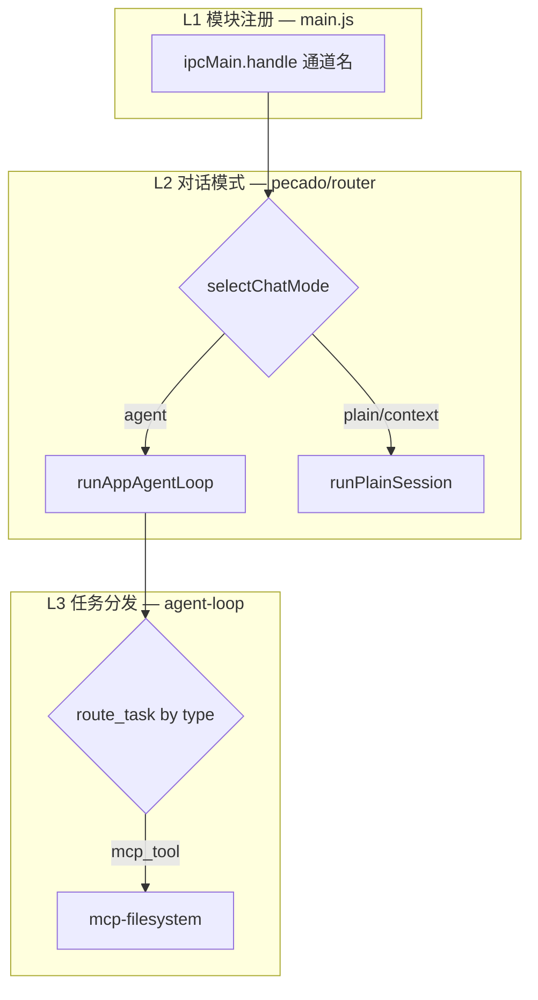
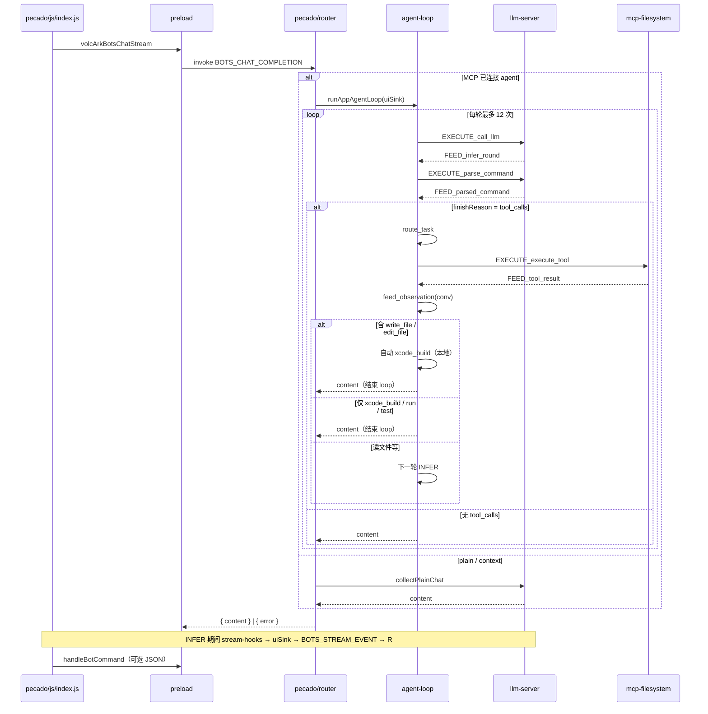
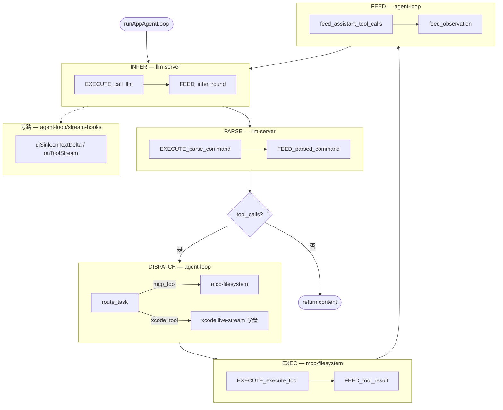
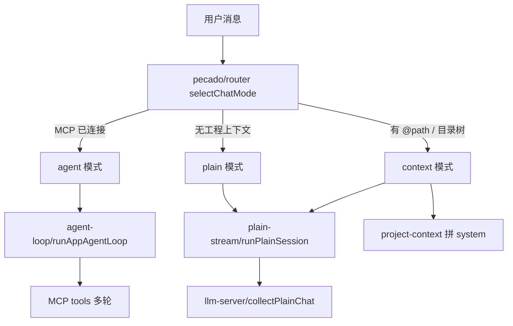

# Pecado

基于 Electron 的桌面 AI 编程助手：对接**火山方舟 Bots** 流式对话，支持本地工程 **MCP 文件系统**、**Function Calling 多轮 Agent**，以及在 macOS 上将生成代码**实时写入磁盘并集成 Xcode 工程**。

---

## 功能概览

| 能力 | 说明 |
|------|------|
| **流式对话** | SSE 增量输出，渲染进程 Markdown 实时渲染（markdown-it + highlight.js） |
| **三种对话模式** | plain（纯聊）/ context（拼工程上下文）/ agent（MCP tools 多轮）— 主进程自动选择 |
| **Open Folder** | 菜单打开工程目录，拉起 MCP server-filesystem，展示目录树 |
| **Agent 工具** | Open Folder 后向 LLM 提供 **13 个 MCP** + **4 个 Xcode**（macOS）Function Calling，见下文 |
| **Skill 注入** | Workflow **开发文档**生成 Skill；勾选「加入 AI」**常驻 Layer 树**（目录导航）+ Instructions（若有）；**正文不进 system**，用 `read_skill_section` 按需读 — 见 [Skill 开发文档](#skill-开发文档分层读-markdown-的设计) |
| **Token 策略** | 写代码后 **1 轮 LLM** + 自动 `xcode_build`；`xcode_run` 仅用户明确要运行时 — 见 [Token 消耗优化](#token-消耗优化) |
| **Workflow** | 局域网**文件服务**、文件归类、PPT 大纲、定时任务 — 见 [src/workflow/README.md](src/workflow/README.md) |
| **Xcode 集成**（macOS） | 新建文件流式落盘、弹窗加入 `.xcodeproj`；build/run 工具与自动编译，见 Agent 工具 |
| **本地指令** | `commands/` — 助手 JSON 指令（如打开 QQ 音乐），与 Agent Loop 无关 |
| **Git 面板** | 自研 SVG 提交时间线 + 底部 status / log / Pecado 助手；Pull / Push / Commit、节点 Git 操作（见下文） |

---

## 依赖包

### 运行时（`dependencies`）

| 包 | 用途 |
|----|------|
| [`@modelcontextprotocol/sdk`](https://www.npmjs.com/package/@modelcontextprotocol/sdk) | MCP 客户端：stdio 传输、`callTool` / `listTools` |
| [`@modelcontextprotocol/server-filesystem`](https://www.npmjs.com/package/@modelcontextprotocol/server-filesystem) | MCP 文件系统服务端（Open Folder 后 spawn） |
| [`markdown-it`](https://www.npmjs.com/package/markdown-it) | Preload 内 Markdown 渲染 |
| [`highlight.js`](https://www.npmjs.com/package/highlight.js) | 代码块语法高亮 |
| [`xcode`](https://www.npmjs.com/package/xcode) | 解析/修改 `project.pbxproj` |

HTTP/SSE 使用 Node/Electron 内置 **`fetch`**。

### 开发 / 打包（`devDependencies`）

| 包 | 用途 |
|----|------|
| [`electron`](https://www.npmjs.com/package/electron) | 桌面壳 |
| [`electron-builder`](https://www.npmjs.com/package/electron-builder) | `npm run build` 打包 |

---

## 项目结构

```
Pecado/
├── assets/icons/
├── config/                    # electron-builder、secrets.example.json
├── src/
│   ├── main/                  # 主进程入口 + 主窗口壳
│   │   ├── js/main.js         # ← package.json main；模块 IPC 注册
│   │   ├── js/bootstrap/load-env.js
│   │   ├── html/index.html
│   │   └── css/index.css
│   ├── pecado/                # 对话层（入口 + UI + 模式路由）
│   │   ├── css/index.css
│   │   └── js/                # register、router、plain-stream、stream-ui、prompts
│   ├── agent-loop/            # Agent 多轮编排（见 agent-loop/README.md）
│   ├── llm-server/            # Volc HTTP/SSE；INFER + PARSE（EXECUTE_* / FEED_*）
│   ├── mcp-filesystem/        # MCP 子进程、读写沙箱、tool-executor（EXEC）
│   ├── xcode/                 # macOS 流式写盘、pbxproj、确认对话框
│   ├── commands/js/           # 本地 JSON 后置指令
│   ├── gitgraph/              # Git 面板（自研 SVG 时间线，见 gitgraph/README.md）
│   ├── workflow/              # Workflow 面板（文件服务、归类、PPT、定时任务，见 workflow/README.md）
│   ├── settings/              # Preferences（html/css/js + register）
│   ├── preload/preload.js
│   ├── shared/                # ipc-channels.js、format-tree.js
│   └── electron/              # dev 启动、窗口探针、env:init
├── package.json
└── README.md
```

各源文件开头有 **【功能 / 职责 / 注册 / 调用方】** 说明。

### 子模块 README

| 文档 | 内容 |
|------|------|
| [src/agent-loop/README.md](src/agent-loop/README.md) | Agent 多轮编排（INFER / PARSE / DISPATCH / EXEC / FEED） |
| [src/gitgraph/README.md](src/gitgraph/README.md) | Git 提交图谱 UI、SVG 布局、节点菜单、IPC |
| [src/workflow/README.md](src/workflow/README.md) | Workflow 面板：文件服务、归类、PPT、定时任务、开发文档 Tab |
| [src/workflow/skill/README.md](src/workflow/skill/README.md) | Skill 模块：保存、Layer 树、资源脚本执行 |

Skill **分层树设计、建树原理、省 token 策略** 以本文 **[§ Skill 开发文档](#skill-开发文档分层读-markdown-的设计)** 为准；子 README 只做模块索引，不重复设计说明。

---

## 安装与运行

```bash
npm install
npm start          # 或 npm run dev
npm run build      # 产物在 release/
```

国内 Electron 镜像：`ELECTRON_MIRROR`（见 `package.json` → `config.electron_mirror`）。

配置 API 密钥：**Preferences → 火山设置**（`~/Library/Application Support/pecado/volc-user-config.json`）。

- **Coding Plan**（套餐）：Model 填 `ark-code-latest` 或 `doubao-seed-2.0-code` 等，**勿填** `bot-` 开头的 Bots ID。
- **Bots**：Model 填 `bot-…` Bot ID。

---

## LLM Function Calling（Agent 工具）

**Open Folder 且 MCP 已连接** 时进入 **agent 模式**。每轮 LLM 请求的 `tools` 数组由主进程组装（`app-agent-loop.js` → `llm-server/format.js` → `mcpToolsToFunctionTools`），**不是** renderer 侧调用。

### 数量

| 来源 | 数量 | 条件 |
|------|------|------|
| **MCP server-filesystem** | **13** | Open Folder 后 `listTools()` |
| **Pecado Xcode** | **4** | 仅 **macOS** |
| **合计** | **17** | macOS + Agent 模式 |
| **合计** | **13** | 非 macOS 或无 Xcode 工具 |

### MCP 工具（13）

| 工具名 | 用途 |
|--------|------|
| `read_text_file` | 读文本文件（可选 head/tail） |
| `read_media_file` | 读图片/音频（base64） |
| `read_multiple_files` | 批量读文件 |
| `write_file` | 新建或覆盖写文件 |
| `edit_file` | 按片段编辑已有文件 |
| `create_directory` | 创建目录 |
| `list_directory` | 列目录 |
| `list_directory_with_sizes` | 列目录（含大小） |
| `move_file` | 移动/重命名 |
| `search_files` | 递归搜索 |
| `directory_tree` | 递归目录树 JSON |
| `get_file_info` | 文件元数据 |
| `list_allowed_directories` | 当前允许访问的根目录 |

包版本：`@modelcontextprotocol/server-filesystem`（见 `node_modules/.../README.md`）。

### Xcode 工具（4，macOS）

定义于 `src/xcode/tools.js`，经 `task-dispatcher` 的 `xcode_tool` 分发：

| 工具名 | 用途 |
|--------|------|
| `xcode_project_status` | scheme / 工程路径 |
| `xcode_build` | `xcodebuild` 编译 |
| `xcode_run` | Xcode ⌘R / 模拟器运行 |
| `xcode_test` | `xcodebuild test` |

### DISPATCH

| `parsedTask.type` | 执行模块 |
|-------------------|----------|
| `mcp_tool` | `mcp-filesystem/tool-executor.js` |
| `xcode_tool` | `xcode/tool-executor.js` |

---

## Token 消耗优化

Agent 默认曾「写代码 → 模型再 build → 再 run → 再修」，**每多一轮都是一次完整 LLM 请求**（带 history + 全套 tools），Coding Plan 下尤其慢且费额度。

当前策略（`agent-loop/agent-reply.js` + `app-agent-loop.js`）：

| 场景 | 行为 | LLM 轮次 |
|------|------|----------|
| **`write_file` / `edit_file` 成功** | 结束 Agent 循环；`composeAgentReply` 拼装摘要返回 | **通常 1 轮** |
| 用户要求 **编译 / Run** | 模型可调 `xcode_build` / `xcode_run`（Skill 脚本用 `run_skill_resource_script`） | 视任务 |
| 只读目录/读文件 | 仍可多轮，直到模型输出文字 | 视任务而定 |

**不消耗 LLM token 的操作**：`xcode_build`、`xcode_run`、MCP `callTool` 本地执行；只有 **tool 结果写回 conv 后的下一轮 INFER** 才计 token——写代码路径已避免该下一轮。

**仍会增加 context 的因素**：对话 history 过长、目录树气泡进 history、单次 tool 观测里的 build 日志尾部（约 12k 字符上限，见 `xcode/build-runner.js` `LOG_TAIL_MAX`）。

Prompt 约定见 `src/pecado/js/prompts/agent.js`（写完后勿再调 `xcode_build`；无运行意图勿调 `xcode_run`）。

### Skill 分层树：省 context token

开发文档 Skill 另有一套 **按 Layer 树按需读** 的策略（与上文「少轮 Agent」互补，省的是 **system / tool 上下文体积**，不是 LLM 轮次）。

**常驻 system 的是 Layer 树（目录导航）+ Instructions（若有 `## Instructions` 段）**；**正文不进 system**，Agent 用 `read_skill_section(path)` 按需读。

| 内容 | 默认是否常驻 system | 如何读取 |
|------|----------------------|----------|
| **Layer 树**（`{skillName}.json`） | **是**（单篇约 8k，树内只有 path/label） | `buildDevDocsContextForAi()` 注入 |
| **Instructions** | **是**（若有；单篇约 6k） | 同上 |
| **Resources / 各小节正文** | **否** | `read_skill_section(path)` 或 `read_dev_doc_resources` |
| **整份 Skill .md** | 仅勾选「原文」时（单篇约 120k） | 全文注入 system |

| 对比 | 无分层树（全文进 system） | 有分层树（默认） |
|------|---------------------------|------------------|
| 勾选「加入 AI」 | 整份 `{skillName}.md` 常驻 system | **Layer 树常驻** + Instructions（若有）；正文按需读 |
| Resources / 长附录 | 每次对话都占 token | **不进 system** |
| 导航 | 模型在全文里找 | system 里已有 Layer 树 → `read_skill_section(path)` 拉正文 |

**省 token 的本质**：`.json` 只存 **目录（path + label）**，不存正文；长文留在磁盘 `.md`，Agent 用到哪一节才通过 tool 拉进对话。多份 Skill、万字文档也不会一次性塞满 context。建树与按需读取见 [Skill 开发文档 § 原始 Markdown 如何生成 Layer 树](#原始-markdown-如何生成-layer-树)。

---

## Skill 开发文档：分层读 Markdown 的设计

Workflow **开发文档** Tab：链接 / 文件 / 手写 → 规范 Skill（`{skillName}.md` + `{skillName}.json`）。`.md` 是正文唯一来源；`.json` 是从 `.md` 解析出的 **Layer 索引树**（只含 path，不含正文），供 Agent 导航。

实现：`src/markdown/skill-layer.js`、`src/workflow/skill/`（见 [skill/README.md](src/workflow/skill/README.md)）。

### 原始 Markdown 如何生成 Layer 树

保存 Skill 时自动执行，从用户输入到 `{skillName}.json`：

```
① 来源            链接 / 本地 .md·.html / 手写
                      ↓  readResourceData（HTML → htmlToMarkdown）
② 原始 Markdown     内存 data（尚未落盘）
                      ↓  generateSkillFromData（markdown 模式补 frontmatter；其他模式 LLM → buildSkillDocument）
③ 规范 Skill .md    frontmatter + ## Instructions + ## Resources → 写入磁盘
                      ↓  buildMarkdownLayerTree(skillMd)     ← skill-layer.js
④ Layer 树 .json    解析标题 → 只写 path 目录 → writeLayerJson
                      ↓  Agent 对话
⑤ 按需读取          system 里已有 Layer 树；正文用 read_skill_section(path)
```

**第 ③ 步 `.md` 长什么样**（`## Instructions` / `## Resources` 为分界）：

```markdown
---
name: my-skill
description: "…skill内容分层,markdown-layer-tree,按需要获取对应信息"
---
# 标题
## Instructions
- 操作要点（默认注入 system，见 Token 节）
## Resources
长原文、附录…
```

**第 ④ 步 `buildMarkdownLayerTree` 在做什么**（不用 npm 包建树；`markdown-it` 仅 UI 预览）：

| 子步骤 | 函数 | 说明 |
|--------|------|------|
| 切大块 | `splitFrontmatter` / `extractH2SectionBody` | `---` → metadata；Instructions 段；Resources 段 |
| 扫标题 | `parseHeadingTree` | 每段逐行 for + 栈：`#`～`######` 开节点，子级压栈，同级弹栈；跳过 ` ``` ` 内假标题 |
| 写索引 | `layerNodesFromHeadingTree` | 每节点算 `path`（如 `resources/章节名`）；无子标题时用正文首行命名；**JSON 不存正文** |

纯 Markdown 原文（尚无 Instructions 段）走同逻辑：frontmatter → `metadata`，正文标题 → `resources/…`（`buildLayerTreeFromMarkdown`）。

**树形示例**：

```
metadata → metadata/name, metadata/description
instructions → instructions/…
resources → resources/章节名
```

### read_skill_section：按 path 读节点内容

1. **分层树**是按 Markdown **标题**（`#`）生成的树。
2. **读节点**时：读原 `.md`，按标题生成 path，匹配树里的 path；

```
read_skill_section(skill_name, "resources/pdf-processing-guide")
        │
        ├─ 1. 读本地 .md 文件
        │
        ├─ 2. 按 # 标题 → parseHeadingTree（和建树时同一套规则）→ 匹配 json 的 path
        │
        ├─ 3. 如果 标题/标题 == path
        │
        └─ 4. 命中节点 → 取该 # 下的 content → 拼成 Markdown 返回
```

实现上会加默认 **大范围**（`metadata` / `instructions` / `resources`），用 `resources` 等包一层：

```
path: resources/pdf-processing-guide/overview
       └─ 大范围 ─┘ └─ 在这个范围里按 # 找 ─────────┘
```

本地操作，不用 npm 解析包；单次返回 ≤12k 字符。

### Agent tool（正文按需读）

Layer 树 **已在 system** 中作为导航。正文不在 system，Agent 模式注册 Skill tools（`workflow/skill/agent/tools.js`）：

| Tool | 作用 |
|------|------|
| `read_skill_layer` | 重新拉 Layer JSON（system 已有时一般不必调） |
| `read_skill_section` | 按 `path` 读一节 **正文** |
| `read_dev_doc_resources` | 整段 Resources |
| `read_skill_resource_file` | 读 Skill 附属资源文件（文本） |
| `run_skill_resource_script` | 执行 Skill 资源目录内 `.sh` / `.py` 脚本 |

列表 Switch 切 **「原文」**（`aiContextMode: full`）才会把整份 `.md` 常驻 system（单篇约 120k），一般不必开。

---

## 架构

### 模块边界（职责一览）

| 模块 | 目录 | 职责 | 不做 |
|------|------|------|------|
| **主框架** | `main/` + `preload/` | 窗口、`index.html`、IPC 桥、模块注册 | 对话逻辑、LLM、MCP |
| **pecado** | `pecado/` | IPC 入口、模式选择、prompts、UI sink、plain 单轮 | 不调 Volc HTTP、不执行 tool、不 DISPATCH |
| **agent-loop** | `agent-loop/` | 多轮 conv、DISPATCH、`stream-hooks` → UI/xcode | 不解析 SSE、不实现 MCP tool |
| **llm-server** | `llm-server/` | HTTP/SSE、INFER、PARSE（`EXECUTE_*` / `FEED_*`） | 不依赖 pecado / mcp / xcode |
| **mcp-filesystem** | `mcp-filesystem/` | MCP 连接、读写沙箱、`EXECUTE_execute_tool` | 不选对话模式、不注册 VOLC IPC |
| **xcode** | `xcode/` | 流式写盘、pbxproj、创建确认 | 不注册 IPC |
| **commands** | `commands/` | 回合结束后 JSON 本地指令 | 不进 Agent Loop |
| **gitgraph** | `gitgraph/` | Git 时间线、Pull/Push/Commit、节点 Git 操作、工程路径栏 | 不进 Agent Loop |
| **settings** | `settings/` | Volc 配置、菜单、Preferences 窗口 | — |

### 主进程模块注册

入口：`src/main/js/main.js` → `app.whenReady()` 内顺序：

| 顺序 | 模块 | 注册文件 | IPC / 能力 |
|------|------|----------|------------|
| 1 | pecado | `pecado/js/register.js` | `VOLC_ARK.BOTS_CHAT_COMPLETION` |
| 2 | commands | `commands/js/register.js` | `QQ_MUSIC.HANDLE_BOT_COMMAND` |
| 3 | settings | `settings/js/register.js` | `SETTINGS.*` |
| 4 | mcp-filesystem | `mcp-filesystem/ipc.js` | `MCP_FS.*` + Open Folder |
| 5 | gitgraph | `gitgraph/js/register.js` | `GIT.*`（含 `NODE_ACTION`） |
| 6 | xcode | `xcode/register.js` | Xcode 自动化权限 |
| 7 | workflow | `workflow/register.js` | `WORKFLOW.*`（文件服务等） |
| 8 | settings | `settings/js/app-menu.js` | 应用菜单栏 |

渲染进程脚本（`main/html/index.html`）：`pecado/js/index.js`、`gitgraph/js/git-chat.js`、`gitgraph/js/index.js`。

---

## 路由结构、命名与方法

Pecado 的路由分**三层**，每层只做一件事；扩展新能力时按层插入，不跨层调用。

### 三层路由

| 层 | 位置 | 路由什么 | 方式 |
|----|------|----------|------|
| **L1 模块注册** | `main/js/main.js` | 哪个 IPC 通道由哪个模块处理 | 启动时 `register(ipcMain)` |
| **L2 对话模式** | `pecado/js/agent/router.js` | plain / context / agent | `selectChatMode()` 读 MCP 状态 |
| **L3 任务分发** | `agent-loop/task-dispatcher.js` | tool 任务交给哪个业务模块 | `route_task()` 按 `task.type` |



**L1** 只管「通道 → 模块」，不管对话逻辑。  
**L2** 只管「这一轮走单轮还是 Agent 多轮」，不执行 tool。  
**L3** 只管「解析出的 task 交给谁」，只在 agent 模式、且模型返回 `tool_calls` 时出现。

### 命名语言

| 术语 | 含义 | 出现在 |
|------|------|--------|
| **register** | 模块向主进程绑定 IPC handler | `*/register.js`、`mcp-filesystem/ipc.js` |
| **router** | 对话入口：选模式、组 messages、调下游 | `pecado/js/agent/router.js` |
| **CHAT_MODES** | `plain` \| `context` \| `agent` | router |
| **uiSink** | 主进程 → 渲染进程的流式 UI 回调对象 | `stream-ui.js` 创建，传给 loop |
| **INFER / PARSE / DISPATCH / EXEC / FEED** | Agent 五节点（LangGraph 风格） | loop + llm-server + mcp |
| **EXECUTE_*** | 业务模块**入口**：Loop 调用的执行函数 | `llm-server`、`mcp-filesystem` |
| **FEED_*** | 业务模块**出口**：结构化结果回 Loop | 同上 |
| **route_task** | Loop **内部**分发，不带 EXECUTE 前缀 | `task-dispatcher.js` |
| **feed_observation** | Loop **内部**写 tool 结果进 conv | `context-feeder.js` |
| **parsedTask** | PARSE 产出：`{ id, type, name, args }` | 不含 exec 策略 |
| **routedTask** | DISPATCH 产出：`{ module, task }` | 供 EXEC 使用 |
| **streamHooks** | INFER 流式副作用注入（UI/xcode） | 由 loop 创建，传给 llm-server |

约定：**EXECUTE_/FEED_ 只挂在业务模块**；Loop 自己用普通动词（`route_task`、`feed_observation`）。

### 方法：怎么写新路由

1. **新 IPC 能力** → 在 `shared/ipc-channels.js` 加通道名 → 新建或扩展模块 `register(ipcMain)` → 在 `main.js` 里调用。
2. **新对话模式** → 在 `CHAT_MODES` 加枚举 → `selectChatMode` 加分支 → router handler 里调对应 runner。
3. **新 tool 类型** → PARSE 产出带新 `type` 的 task → `route_task` 加 `case` → 目标模块实现 `EXECUTE_*` / `FEED_*` → loop 里按 `module` 调用（或扩展现有 EXEC）。

依赖始终单向：**pecado → agent-loop → llm-server / mcp**；业务模块不 require pecado。

### 结构代码示例

以下为**模式示意**，展示接口形状与注册方式，不是运行时完整实现。

#### 1. 模块注册（L1）

```js
// main/js/main.js — 启动时装配
app.whenReady().then(() => {
  pecado.register(ipcMain);      // VOLC_ARK
  commands.register(ipcMain);    // QQ_MUSIC
  mcpFilesystemIpc.register(ipcMain, () => mainWindowRef);
});

// pecado/js/register.js — 每个模块一个 register
function register(ipcMain) {
  router.register(ipcMain);  // 内部绑定 ipcMain.handle(...)
}
module.exports = { register };
```

#### 2. IPC 通道单一数据源

```js
// shared/ipc-channels.js
module.exports = {
  VOLC_ARK: {
    BOTS_CHAT_COMPLETION: 'volc-ark-bots-chat-completion',
    BOTS_STREAM_EVENT: 'volc-ark-bots-stream-event',
  },
  MCP_FS: { DIRECTORY_TREE: 'mcp-fs-directory-tree', PROJECT_CHANGED: 'mcp-fs-project-changed' },
};
```

#### 3. 对话模式路由（L2）

```js
// pecado/js/agent/router.js — 模式决策 + 分发到 runner
const CHAT_MODES = { PLAIN: 'plain', CONTEXT: 'context', AGENT: 'agent' };

async function selectChatMode({ userText, history }) {
  if (projectIo.getStatus().connected) {
    return { mode: CHAT_MODES.AGENT, messages: buildChatMessages('agent', userText, history), xcodeStreamPath: '...' };
  }
  const ctx = await buildProjectContextForAi(userText);
  const mode = ctx.trim() ? CHAT_MODES.CONTEXT : CHAT_MODES.PLAIN;
  return { mode, messages: buildChatMessages(mode, userText, history, ctx), xcodeStreamPath: null };
}

// handler 内
if (mode === CHAT_MODES.AGENT) {
  return runAppAgentLoop(createUiStreamSink(sender, streamId), apiKey, model, messages, loopOpts);
}
return runPlainSession({ apiKey, model, messages, uiSink, xcodeAbsPath });
```

#### 4. uiSink：UI 旁路（不是 EXEC 节点）

```js
// pecado/js/agent/stream-ui.js — 主进程推流到 renderer
function createUiStreamSink(sender, streamId) {
  return {
    onTextDelta(text) { sender.send(VOLC_ARK.BOTS_STREAM_EVENT, { streamId, phase: 'delta', text }); },
    onTool(info)     { sender.send(VOLC_ARK.BOTS_STREAM_EVENT, { streamId, phase: 'tool', ...info }); },
    onError(error)   { sender.send(VOLC_ARK.BOTS_STREAM_EVENT, { streamId, phase: 'error', error }); },
  };
}
```

#### 5. 业务模块契约：EXECUTE / FEED

```js
// llm-server — INFER 节点
async function EXECUTE_call_llm(chatOpts, streamHooks) { /* streamChat + hooks */ }
function FEED_infer_round(inferRaw, streamContext) { return { ok: true, data: { ... } }; }

// llm-server — PARSE 节点
function EXECUTE_parse_command(inferRound) {
  return { tasks: [{ id, type: 'mcp_tool', name, args }], assistantMessage, finishReason };
}
function FEED_parsed_command(parsedRaw) { return { ok: true, data: parsedRaw }; }

// mcp-filesystem — EXEC 节点
async function EXECUTE_execute_tool(routedTask, execOpts) {
  if (routedTask.module !== 'mcp-filesystem') return { isError: true, content: [...] };
  return projectIo.callTool(routedTask.task.name, routedTask.task.args);
}
function FEED_tool_result(execRaw) { return { ok: !execRaw?.isError, observation: '...' }; }
```

#### 6. 任务分发（L3）

```js
// agent-loop/task-dispatcher.js
function route_task(parsedTask) {
  switch (parsedTask.type) {
    case 'mcp_tool':
      return { module: 'mcp-filesystem', task: parsedTask };
    // case 'git_op':
    //   return { module: 'gitgraph', task: parsedTask };
    default:
      return { error: `DISPATCH：未知任务 type「${parsedTask.type}」` };
  }
}
```

#### 7. Loop 编排骨架（只展示调用关系）

```js
// agent-loop — 每轮固定流水线，不含实现细节
for (let round = 0; round < MAX_TOOL_ROUNDS; round++) {
  const inferFeed = FEED_infer_round(await EXECUTE_call_llm(chatOpts, hooks), streamContext);
  const parseFeed = FEED_parsed_command(EXECUTE_parse_command(inferFeed.data));
  if (parseFeed.data.finishReason !== 'tool_calls') return { content: parseFeed.data.content };

  feed_assistant_tool_calls(conv, parseFeed.data.assistantMessage);
  for (const parsedTask of parseFeed.data.tasks) {
    const routed = route_task(parsedTask);
    const toolFeed = FEED_tool_result(await EXECUTE_execute_tool(routed, { streamContext }));
    feed_observation(conv, parsedTask, toolFeed);
  }
  chatOpts.messages = conv;
}
```

#### 8. 回合后本地指令（独立于 Agent）

```js
// renderer — 对话结束后可选 JSON 指令，不走 loop
const { displayText } = await electronAPI.handleBotCommand(reply);

// commands/js/local-commands.js — 主进程解析 { "cmd": "open qq music" }
ipcMain.handle(QQ_MUSIC.HANDLE_BOT_COMMAND, (_e, { rawContent }) => handleBotCommand(rawContent));
```

---

### 依赖方向

```mermaid
flowchart LR
  subgraph renderer [Renderer]
    PUI[pecado/js/index.js]
  end

  subgraph main [Main Process]
    Router[pecado/router]
    Loop[agent-loop]
    LLM[llm-server]
    MCP[mcp-filesystem]
    Xcode[xcode]
    Cmd[commands]
  end

  PUI -->|invoke BOTS_CHAT| Router
  Router -->|agent| Loop
  Router -->|plain/context| LLM
  Loop --> LLM
  Loop --> MCP
  Loop --> Xcode
  Loop -.->|uiSink hooks| PUI
  PUI -->|post-chat JSON| Cmd

  LLM -.x.-> Router
  MCP -.x.-> Loop
  Loop -.x.-> Router
```

> `-.x.-` 表示**不应**出现的反向依赖（当前代码已遵守）。

---

## 流程图

### 1. 端到端：用户发消息



### 2. Agent Loop 五节点（每轮）



### 3. 三种对话模式



### 4. EXECUTE / FEED 命名约定

| 节点 | 模块 | 入口（Loop 调用） | 出口（回 Loop） | Loop 内部 |
|------|------|-------------------|-----------------|-----------|
| INFER | llm-server | `EXECUTE_call_llm` | `FEED_infer_round` | — |
| PARSE | llm-server | `EXECUTE_parse_command` | `FEED_parsed_command` | — |
| DISPATCH | agent-loop | — | — | `route_task` |
| EXEC | mcp-filesystem | `EXECUTE_execute_tool` | `FEED_tool_result` | — |
| 写 conv | agent-loop | — | — | `feed_observation` |

`EXECUTE_*` / `FEED_*` 只出现在**业务模块**；Loop 内部方法不带此前缀。

---

## MCP 与 Xcode

1. **File → Open Folder**（`mcp-filesystem/ipc.js`）选择工程根
2. 主进程 spawn MCP server-filesystem，推送 `MCP_FS.PROJECT_CHANGED`
3. Agent 模式：`route_task` → `EXECUTE_execute_tool` → MCP `callTool` 或 macOS 本地写盘
4. INFER 流式 `write_file`：`stream-hooks` + `xcode/live-stream` 增量落盘
5. 新建路径：`xcode/prompt.js` 确认是否加入 `.xcodeproj`

---

## Git 面板（gitgraph 模块）

侧栏 **Git** 使用**自研 SVG 时间线**（`src/gitgraph/`，不依赖 `@gitgraph/js`）。与 **File → Open Folder** 共用工程根目录（`userData/mcp-project.json`）。详细布局与滚动策略见 **[src/gitgraph/README.md](src/gitgraph/README.md)**。

### 打开方式

1. 侧栏点击 **Git**（与 **Pecado** 同级，全页切换）
2. 菜单 **View → Git 面板**（`Cmd/Ctrl+2`）；**View → Pecado**（`Cmd/Ctrl+1`）
3. Git 页内窗口底栏图标：展开/收起底部 **status | log | pecado** 区域

### 前置条件

1. **File → Open Folder** 打开 Git 仓库根目录。
2. 顶栏 **meta 栏**（`#git-message`）显示分支、操作进度与仓库状态摘要。
3. **Preferences → 通用 → Git 提交图条数**：100 / 200 / 500 / 1000 / 1500 / 5000。

### 面板结构

| 区域 | 功能 |
|------|------|
| **工具栏** | Push、Pull、Commit（`git push` / `git pull` / `git add -A && commit`） |
| **Meta 栏** | 实时操作进度与完成状态（如「拉取完成 · 已是最新 · 工作区干净」）；右侧当前分支 |
| **时间线** | SVG 分支图 + 轨道 tint + commit 色块 + subject 文字（四层叠放） |
| **底部双滚动条** | 左：图区横向滚动；右：commit 文字起始位置（与图区解耦） |
| **底部 Dock — status** | 选中节点后展示 commit 详情；未选中时显示 `git status` |
| **底部 Dock — log** | 仅 Git 命令输出与错误（不含 Pecado 对话内容） |
| **底部 Dock — pecado** | Git 专用助手：可点击 push/pull/status/commit/branch；shell 命令需「同意」；多条命令可「按顺序全部执行」 |

### 节点交互

| 操作 | 行为 |
|------|------|
| **悬浮节点圆** | 节点上方显示作者姓名（独立 `fixed` 浮层，背景 `#000`） |
| **单击节点圆** | 选中 commit（白描边）；底部 Status 切换为该 commit 信息；关闭已打开的右键菜单 |
| **右键 / 双指点击节点圆** | 弹出 Git 操作菜单（独立 `fixed` 浮层，菜单左上角对齐节点圆心；超出窗口时自动平移以保证完整可见） |

仅 SVG **圆点**可交互；轨道条、色块、文字层 `pointer-events: none`，不抢点击。

### 节点右键菜单

主进程经 `GIT.NODE_ACTION` → `git-runner.runNodeAction` 执行，完成后刷新图谱与 Status。

| 菜单项 | `action` | 说明 |
|--------|----------|------|
| Checkout this commit | `checkout` | `git checkout <hash>`（确认框） |
| Create branch here | `branch` | 输入分支名 → `git branch <name> <hash>` |
| Cherry pick commit | `cherry-pick` | `git cherry-pick <hash>` |
| Reset … to this commit | `reset` | 子菜单 Mixed / Soft / Hard → `git reset --<mode> <hash>` |
| Revert commit | `revert` | `git revert --no-edit <hash>` |
| Copy commit sha | — | 剪贴板写入完整 hash（渲染进程） |
| Copy link … on remote: origin | — | 由 `remoteOriginUrl` 生成 HTTPS commit 链接（无 origin 时禁用） |
| Create patch from commit | `format-patch` | `git format-patch -1` 输出复制到剪贴板 |
| Create tag here | `tag` | 输入标签名 → `git tag <name> <hash>` |
| Create annotated tag here | `tag-annotated` | 输入名与说明 → `git tag -a` |

### 显示策略（摘要）

为兼容极端情况（超长 commit 信息、多 lane、大量提交），横向可滚区域**故意加宽**：

| 区域 | 可滚 inner 宽度 | 作用 |
|------|-----------------|------|
| **节点图** | **3 × 窗宽**（左留白 1W + SVG + 右留白 1W） | 任意节点/分支线可出现在屏幕从左到右任意 x |
| **Commit 文字** | 左留白 1W +（最长 subject 宽 **+ 1W**） | 文字左缘可出现在屏幕任意 x（默认 W×1/2） |

**节点 ↔ commit 对应**：每一行共享同一 `row-index` — SVG 圆点、轨道 tint（节点竖线 → 右缘）、commit 色块/文字为同一 hash。图区 scroll 与 commit scroll **解耦**（轨道只随图区滚）。

默认锚点：最新节点圆心 **W×1/4**；commit 文字左缘 **W×1/2**。

| 层 | 显示方式 | 滚动 |
|----|----------|------|
| **节点** | 每行圆点（lane 色 + 作者首字母）；仅圆点可点选 | 随图区横向滚 |
| **轨道** | 半透明 tint：节点竖线 → 窗口右缘 | 固定视口；随图区 scroll 更新 |
| **Commit 色块** | 实色（lane 24% 叠 `#161616`）：文字列起点 → 右缘 | 固定视口；左缘随 commit 滑块 |
| **Commit 文字** | 白/灰 subject，左内边距 28px | inner 可滚 |

横向滚轮只滚图区；滚动/缩放窗口时关闭节点浮层菜单。

### IPC（`GIT.*`）

| 通道 | 用途 |
|------|------|
| `GET_PANEL_HTML` | 读取 `gitgraph/html/index.html` 注入 `#panel-git` |
| `GET_STATE` | 分支、`git status`、图谱数据、`remoteOriginUrl` |
| `PULL` / `PUSH` / `COMMIT` | 工具栏 Git 命令 |
| `RUN_SHELL` | Pecado 助手确认后执行 shell（`git` / `cd` / `mkdir` 等） |
| `NODE_ACTION` | 节点右键菜单：`{ action, hash, branchName?, resetMode?, tagName?, tagMessage?, projectRoot? }` |

渲染端：`preload/preload.js` → `gitGetState`、`gitPull`、`gitPush`、`gitCommit`、`gitNodeAction` 等。

### Push 到远端

**用户工程（应用内）**：Open Folder → Git 面板 → **Push**（`git push`）。

**本仓库（终端）**：

```bash
git add -A
git commit -m "描述本次改动"
git push origin main
```

新分支首次：`git push -u origin <branch>`。

---

## 主要文件索引

| 能力 | 文件 |
|------|------|
| 主进程入口 + 注册 | `src/main/js/main.js` |
| 对话 IPC + 模式路由 | `src/pecado/js/agent/router.js` |
| 对话 UI（renderer） | `src/pecado/js/index.js` |
| Agent 编排 | `src/agent-loop/app-agent-loop.js`（详见 [src/agent-loop/README.md](src/agent-loop/README.md)） |
| 写代码短路返回 | `src/agent-loop/agent-reply.js` |
| 写入前 read 守卫 | `src/agent-loop/write-guard.js` |
| INFER | `src/llm-server/llm-infer-service.js` |
| PARSE | `src/llm-server/command-parser.js` |
| DISPATCH | `src/agent-loop/task-dispatcher.js` |
| EXEC | `src/mcp-filesystem/tool-executor.js` |
| stream-hooks（UI/xcode） | `src/agent-loop/stream-hooks.js` |
| plain/context 单轮 | `src/pecado/js/agent/plain-stream.js` |
| UI 流推送 | `src/pecado/js/agent/stream-ui.js` |
| 本地 JSON 指令 | `src/commands/js/local-commands.js` |
| Git 时间线 UI | `src/gitgraph/js/index.js` |
| Git Pecado 助手 | `src/gitgraph/js/git-chat.js` |
| Git 布局 / lane | `src/gitgraph/js/timeline-layout.js` |
| Git CLI / 节点操作 | `src/gitgraph/js/git-runner.js` |
| Git log 解析 | `src/gitgraph/js/log-parser.js` |
| Git 主进程 IPC | `src/gitgraph/js/register.js` |
| 工程上下文 | `src/mcp-filesystem/project-context.js` |
| Workflow 文件服务 | `src/workflow/file-service/server.js` |
| Skill 模块 | `src/workflow/skill/`（见 [skill/README.md](src/workflow/skill/README.md)） |
| Skill 执行日志 | `src/shared/agent-log.js`、`src/pecado/js/skill-log-panel.js` |
| IPC 通道常量 | `src/shared/ipc-channels.js` |
| Preload | `src/preload/preload.js` |

---

## 开发提示

- **改 IPC 通道名**：只改 `src/shared/ipc-channels.js`，同步 preload 与主进程
- **改 LLM 适配**：只改 `llm-server/`；agent-loop 不应直接 sanitize messages
- **改 Agent 节点**：`agent-loop/` + `llm-server/` 对应 INFER/PARSE 文件
- **改 tool 行为**：`mcp-filesystem/tool-executor.js`（含 `resolveExecHints`）
- **扩展 DISPATCH**：`agent-loop/task-dispatcher.js` 加 `type` 分支 + 新模块 `EXECUTE_*`
- **改 Git 面板**：`gitgraph/js/index.js`（渲染）、`git-runner.js`（CLI）、`register.js`（IPC）；通道见 `GIT.*`

## License

MIT
