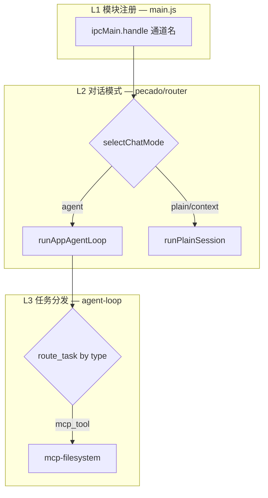
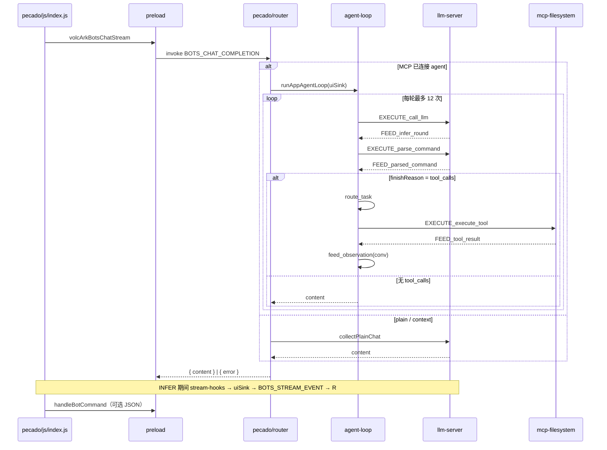
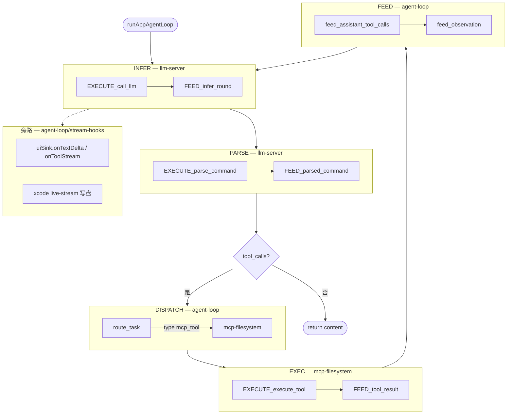
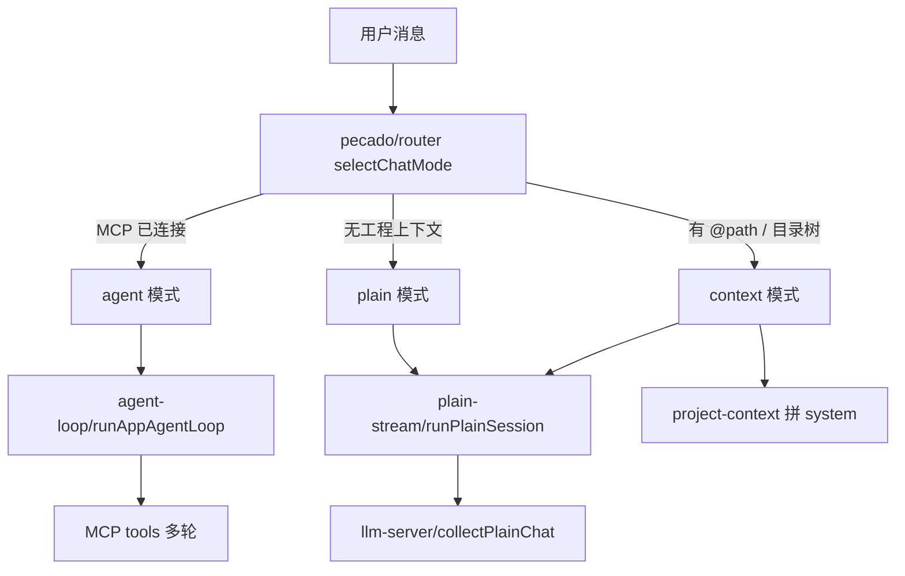

# Pecado

基于 Electron 的桌面 AI 编程助手：对接**火山方舟 Bots** 流式对话，支持本地工程 **MCP 文件系统**、**Function Calling 多轮 Agent**，以及在 macOS 上将生成代码**实时写入磁盘并集成 Xcode 工程**。

---

## 功能概览

| 能力 | 说明 |
|------|------|
| **流式对话** | SSE 增量输出，渲染进程 Markdown 实时渲染（markdown-it + highlight.js） |
| **三种对话模式** | plain（纯聊）/ context（拼工程上下文）/ agent（MCP tools 多轮）— 主进程自动选择 |
| **Open Folder** | 菜单打开工程目录，拉起 MCP server-filesystem，展示目录树 |
| **Agent 工具** | read / write / edit / create_directory 等，经主进程沙箱执行 |
| **Xcode 集成**（macOS） | 新建文件流式落盘、弹窗加入 `.xcodeproj`、自动 `open` Xcode |
| **本地指令** | `commands/` — 助手 JSON 指令（如打开 QQ 音乐），与 Agent Loop 无关 |

---

## 依赖包

### 运行时（`dependencies`）

| 包 | 用途 |
|----|------|
| [`@modelcontextprotocol/sdk`](https://www.npmjs.com/package/@modelcontextprotocol/sdk) | MCP 客户端：stdio 传输、`callTool` / `listTools` |
| [`@modelcontextprotocol/server-filesystem`](https://www.npmjs.com/package/@modelcontextprotocol/server-filesystem) | MCP 文件系统服务端（Open Folder 后 spawn） |
| [`markdown-it`](https://www.npmjs.com/package/markdown-it) | Preload 内 Markdown 渲染 |
| [`highlight.js`](https://www.npmjs.com/package/highlight.js) | 代码块语法高亮 |
| [`xcode`](https://www.npmjs.com/package/xcode) | 解析/修改 `project.pbxproj` |
| [`@gitgraph/js`](https://www.npmjs.com/package/@gitgraph/js) | Git 提交图 UI |

HTTP/SSE 使用 Node/Electron 内置 **`fetch`**。

### 开发 / 打包（`devDependencies`）

| 包 | 用途 |
|----|------|
| [`electron`](https://www.npmjs.com/package/electron) | 桌面壳 |
| [`electron-builder`](https://www.npmjs.com/package/electron-builder) | `npm run build` 打包 |

---

## 项目结构

```
Pecado/
├── assets/icons/
├── config/                    # electron-builder、secrets.example.json
├── src/
│   ├── main/                  # 主进程入口 + 主窗口壳
│   │   ├── js/main.js         # ← package.json main；模块 IPC 注册
│   │   ├── js/bootstrap/load-env.js
│   │   ├── html/index.html
│   │   └── css/index.css
│   ├── pecado/                # 对话层（入口 + UI + 模式路由）
│   │   ├── css/index.css
│   │   └── js/                # register、router、plain-stream、stream-ui、prompts
│   ├── agent-loop/            # Agent 多轮编排（DISPATCH + conv + stream-hooks）
│   ├── llm-server/            # Volc HTTP/SSE；INFER + PARSE（EXECUTE_* / FEED_*）
│   ├── mcp-filesystem/        # MCP 子进程、读写沙箱、tool-executor（EXEC）
│   ├── xcode/                 # macOS 流式写盘、pbxproj、确认对话框
│   ├── commands/js/           # 本地 JSON 后置指令
│   ├── gitgraph/              # Git 面板（html/css/js + register）
│   ├── settings/              # Preferences（html/css/js + register）
│   ├── preload/preload.js
│   ├── shared/                # ipc-channels.js、format-tree.js
│   └── electron/              # dev 启动、窗口探针、env:init
├── package.json
└── README.md
```

各源文件开头有 **【功能 / 职责 / 注册 / 调用方】** 说明。

---

## 安装与运行

```bash
npm install
npm start          # 或 npm run dev
npm run build      # 产物在 release/
```

国内 Electron 镜像：`ELECTRON_MIRROR`（见 `package.json` → `config.electron_mirror`）。

配置 API 密钥：**Preferences → 火山设置**（`~/Library/Application Support/pecado/volc-user-config.json`）。

---

## 架构

### 模块边界（职责一览）

| 模块 | 目录 | 职责 | 不做 |
|------|------|------|------|
| **主框架** | `main/` + `preload/` | 窗口、`index.html`、IPC 桥、模块注册 | 对话逻辑、LLM、MCP |
| **pecado** | `pecado/` | IPC 入口、模式选择、prompts、UI sink、plain 单轮 | 不调 Volc HTTP、不执行 tool、不 DISPATCH |
| **agent-loop** | `agent-loop/` | 多轮 conv、DISPATCH、`stream-hooks` → UI/xcode | 不解析 SSE、不实现 MCP tool |
| **llm-server** | `llm-server/` | HTTP/SSE、INFER、PARSE（`EXECUTE_*` / `FEED_*`） | 不依赖 pecado / mcp / xcode |
| **mcp-filesystem** | `mcp-filesystem/` | MCP 连接、读写沙箱、`EXECUTE_execute_tool` | 不选对话模式、不注册 VOLC IPC |
| **xcode** | `xcode/` | 流式写盘、pbxproj、创建确认 | 不注册 IPC |
| **commands** | `commands/` | 回合结束后 JSON 本地指令 | 不进 Agent Loop |
| **gitgraph** | `gitgraph/` | Git 状态 / pull / push / commit | 不进 Agent Loop |
| **settings** | `settings/` | Volc 配置、菜单、Preferences 窗口 | — |

### 主进程模块注册

入口：`src/main/js/main.js` → `app.whenReady()` 内顺序：

| 顺序 | 模块 | 注册文件 | IPC / 能力 |
|------|------|----------|------------|
| 1 | pecado | `pecado/js/register.js` | `VOLC_ARK.BOTS_CHAT_COMPLETION` |
| 2 | commands | `commands/js/register.js` | `QQ_MUSIC.HANDLE_BOT_COMMAND` |
| 3 | settings | `settings/js/register.js` | `SETTINGS.*` |
| 4 | mcp-filesystem | `mcp-filesystem/ipc.js` | `MCP_FS.*` + Open Folder |
| 5 | gitgraph | `gitgraph/js/register.js` | `GIT.*` |
| 6 | settings | `settings/js/app-menu.js` | 应用菜单栏 |

渲染进程脚本（`main/html/index.html`）：`pecado/js/index.js`、`gitgraph/js/index.js`。

---

## 路由结构、命名与方法

Pecado 的路由分**三层**，每层只做一件事；扩展新能力时按层插入，不跨层调用。

### 三层路由

| 层 | 位置 | 路由什么 | 方式 |
|----|------|----------|------|
| **L1 模块注册** | `main/js/main.js` | 哪个 IPC 通道由哪个模块处理 | 启动时 `register(ipcMain)` |
| **L2 对话模式** | `pecado/js/agent/router.js` | plain / context / agent | `selectChatMode()` 读 MCP 状态 |
| **L3 任务分发** | `agent-loop/task-dispatcher.js` | tool 任务交给哪个业务模块 | `route_task()` 按 `task.type` |



**L1** 只管「通道 → 模块」，不管对话逻辑。  
**L2** 只管「这一轮走单轮还是 Agent 多轮」，不执行 tool。  
**L3** 只管「解析出的 task 交给谁」，只在 agent 模式、且模型返回 `tool_calls` 时出现。

### 命名语言

| 术语 | 含义 | 出现在 |
|------|------|--------|
| **register** | 模块向主进程绑定 IPC handler | `*/register.js`、`mcp-filesystem/ipc.js` |
| **router** | 对话入口：选模式、组 messages、调下游 | `pecado/js/agent/router.js` |
| **CHAT_MODES** | `plain` \| `context` \| `agent` | router |
| **uiSink** | 主进程 → 渲染进程的流式 UI 回调对象 | `stream-ui.js` 创建，传给 loop |
| **INFER / PARSE / DISPATCH / EXEC / FEED** | Agent 五节点（LangGraph 风格） | loop + llm-server + mcp |
| **EXECUTE_*** | 业务模块**入口**：Loop 调用的执行函数 | `llm-server`、`mcp-filesystem` |
| **FEED_*** | 业务模块**出口**：结构化结果回 Loop | 同上 |
| **route_task** | Loop **内部**分发，不带 EXECUTE 前缀 | `task-dispatcher.js` |
| **feed_observation** | Loop **内部**写 tool 结果进 conv | `context-feeder.js` |
| **parsedTask** | PARSE 产出：`{ id, type, name, args }` | 不含 exec 策略 |
| **routedTask** | DISPATCH 产出：`{ module, task }` | 供 EXEC 使用 |
| **streamHooks** | INFER 流式副作用注入（UI/xcode） | 由 loop 创建，传给 llm-server |

约定：**EXECUTE_/FEED_ 只挂在业务模块**；Loop 自己用普通动词（`route_task`、`feed_observation`）。

### 方法：怎么写新路由

1. **新 IPC 能力** → 在 `shared/ipc-channels.js` 加通道名 → 新建或扩展模块 `register(ipcMain)` → 在 `main.js` 里调用。
2. **新对话模式** → 在 `CHAT_MODES` 加枚举 → `selectChatMode` 加分支 → router handler 里调对应 runner。
3. **新 tool 类型** → PARSE 产出带新 `type` 的 task → `route_task` 加 `case` → 目标模块实现 `EXECUTE_*` / `FEED_*` → loop 里按 `module` 调用（或扩展现有 EXEC）。

依赖始终单向：**pecado → agent-loop → llm-server / mcp**；业务模块不 require pecado。

### 结构代码示例

以下为**模式示意**，展示接口形状与注册方式，不是运行时完整实现。

#### 1. 模块注册（L1）

```js
// main/js/main.js — 启动时装配
app.whenReady().then(() => {
  pecado.register(ipcMain);      // VOLC_ARK
  commands.register(ipcMain);    // QQ_MUSIC
  mcpFilesystemIpc.register(ipcMain, () => mainWindowRef);
});

// pecado/js/register.js — 每个模块一个 register
function register(ipcMain) {
  router.register(ipcMain);  // 内部绑定 ipcMain.handle(...)
}
module.exports = { register };
```

#### 2. IPC 通道单一数据源

```js
// shared/ipc-channels.js
module.exports = {
  VOLC_ARK: {
    BOTS_CHAT_COMPLETION: 'volc-ark-bots-chat-completion',
    BOTS_STREAM_EVENT: 'volc-ark-bots-stream-event',
  },
  MCP_FS: { DIRECTORY_TREE: 'mcp-fs-directory-tree', PROJECT_CHANGED: 'mcp-fs-project-changed' },
};
```

#### 3. 对话模式路由（L2）

```js
// pecado/js/agent/router.js — 模式决策 + 分发到 runner
const CHAT_MODES = { PLAIN: 'plain', CONTEXT: 'context', AGENT: 'agent' };

async function selectChatMode({ userText, history }) {
  if (projectIo.getStatus().connected) {
    return { mode: CHAT_MODES.AGENT, messages: buildChatMessages('agent', userText, history), xcodeStreamPath: '...' };
  }
  const ctx = await buildProjectContextForAi(userText);
  const mode = ctx.trim() ? CHAT_MODES.CONTEXT : CHAT_MODES.PLAIN;
  return { mode, messages: buildChatMessages(mode, userText, history, ctx), xcodeStreamPath: null };
}

// handler 内
if (mode === CHAT_MODES.AGENT) {
  return runAppAgentLoop(createUiStreamSink(sender, streamId), apiKey, model, messages, loopOpts);
}
return runPlainSession({ apiKey, model, messages, uiSink, xcodeAbsPath });
```

#### 4. uiSink：UI 旁路（不是 EXEC 节点）

```js
// pecado/js/agent/stream-ui.js — 主进程推流到 renderer
function createUiStreamSink(sender, streamId) {
  return {
    onTextDelta(text) { sender.send(VOLC_ARK.BOTS_STREAM_EVENT, { streamId, phase: 'delta', text }); },
    onTool(info)     { sender.send(VOLC_ARK.BOTS_STREAM_EVENT, { streamId, phase: 'tool', ...info }); },
    onError(error)   { sender.send(VOLC_ARK.BOTS_STREAM_EVENT, { streamId, phase: 'error', error }); },
  };
}
```

#### 5. 业务模块契约：EXECUTE / FEED

```js
// llm-server — INFER 节点
async function EXECUTE_call_llm(chatOpts, streamHooks) { /* streamChat + hooks */ }
function FEED_infer_round(inferRaw, streamContext) { return { ok: true, data: { ... } }; }

// llm-server — PARSE 节点
function EXECUTE_parse_command(inferRound) {
  return { tasks: [{ id, type: 'mcp_tool', name, args }], assistantMessage, finishReason };
}
function FEED_parsed_command(parsedRaw) { return { ok: true, data: parsedRaw }; }

// mcp-filesystem — EXEC 节点
async function EXECUTE_execute_tool(routedTask, execOpts) {
  if (routedTask.module !== 'mcp-filesystem') return { isError: true, content: [...] };
  return projectIo.callTool(routedTask.task.name, routedTask.task.args);
}
function FEED_tool_result(execRaw) { return { ok: !execRaw?.isError, observation: '...' }; }
```

#### 6. 任务分发（L3）

```js
// agent-loop/task-dispatcher.js
function route_task(parsedTask) {
  switch (parsedTask.type) {
    case 'mcp_tool':
      return { module: 'mcp-filesystem', task: parsedTask };
    // case 'git_op':
    //   return { module: 'gitgraph', task: parsedTask };
    default:
      return { error: `DISPATCH：未知任务 type「${parsedTask.type}」` };
  }
}
```

#### 7. Loop 编排骨架（只展示调用关系）

```js
// agent-loop — 每轮固定流水线，不含实现细节
for (let round = 0; round < MAX_TOOL_ROUNDS; round++) {
  const inferFeed = FEED_infer_round(await EXECUTE_call_llm(chatOpts, hooks), streamContext);
  const parseFeed = FEED_parsed_command(EXECUTE_parse_command(inferFeed.data));
  if (parseFeed.data.finishReason !== 'tool_calls') return { content: parseFeed.data.content };

  feed_assistant_tool_calls(conv, parseFeed.data.assistantMessage);
  for (const parsedTask of parseFeed.data.tasks) {
    const routed = route_task(parsedTask);
    const toolFeed = FEED_tool_result(await EXECUTE_execute_tool(routed, { streamContext }));
    feed_observation(conv, parsedTask, toolFeed);
  }
  chatOpts.messages = conv;
}
```

#### 8. 回合后本地指令（独立于 Agent）

```js
// renderer — 对话结束后可选 JSON 指令，不走 loop
const { displayText } = await electronAPI.handleBotCommand(reply);

// commands/js/local-commands.js — 主进程解析 { "cmd": "open qq music" }
ipcMain.handle(QQ_MUSIC.HANDLE_BOT_COMMAND, (_e, { rawContent }) => handleBotCommand(rawContent));
```

---

### 依赖方向

```mermaid
flowchart LR
  subgraph renderer [Renderer]
    PUI[pecado/js/index.js]
  end

  subgraph main [Main Process]
    Router[pecado/router]
    Loop[agent-loop]
    LLM[llm-server]
    MCP[mcp-filesystem]
    Xcode[xcode]
    Cmd[commands]
  end

  PUI -->|invoke BOTS_CHAT| Router
  Router -->|agent| Loop
  Router -->|plain/context| LLM
  Loop --> LLM
  Loop --> MCP
  Loop --> Xcode
  Loop -.->|uiSink hooks| PUI
  PUI -->|post-chat JSON| Cmd

  LLM -.x.-> Router
  MCP -.x.-> Loop
  Loop -.x.-> Router
```

> `-.x.-` 表示**不应**出现的反向依赖（当前代码已遵守）。

---

## 流程图

### 1. 端到端：用户发消息



### 2. Agent Loop 五节点（每轮）



### 3. 三种对话模式



### 4. EXECUTE / FEED 命名约定

| 节点 | 模块 | 入口（Loop 调用） | 出口（回 Loop） | Loop 内部 |
|------|------|-------------------|-----------------|-----------|
| INFER | llm-server | `EXECUTE_call_llm` | `FEED_infer_round` | — |
| PARSE | llm-server | `EXECUTE_parse_command` | `FEED_parsed_command` | — |
| DISPATCH | agent-loop | — | — | `route_task` |
| EXEC | mcp-filesystem | `EXECUTE_execute_tool` | `FEED_tool_result` | — |
| 写 conv | agent-loop | — | — | `feed_observation` |

`EXECUTE_*` / `FEED_*` 只出现在**业务模块**；Loop 内部方法不带此前缀。

---

## MCP 与 Xcode

1. **File → Open Folder**（`mcp-filesystem/ipc.js`）选择工程根
2. 主进程 spawn MCP server-filesystem，推送 `MCP_FS.PROJECT_CHANGED`
3. Agent 模式：`route_task` → `EXECUTE_execute_tool` → MCP `callTool` 或 macOS 本地写盘
4. INFER 流式 `write_file`：`stream-hooks` + `xcode/live-stream` 增量落盘
5. 新建路径：`xcode/prompt.js` 确认是否加入 `.xcodeproj`

---

## 主要文件索引

| 能力 | 文件 |
|------|------|
| 主进程入口 + 注册 | `src/main/js/main.js` |
| 对话 IPC + 模式路由 | `src/pecado/js/agent/router.js` |
| 对话 UI（renderer） | `src/pecado/js/index.js` |
| Agent 编排 | `src/agent-loop/app-agent-loop.js` |
| INFER | `src/llm-server/llm-infer-service.js` |
| PARSE | `src/llm-server/command-parser.js` |
| DISPATCH | `src/agent-loop/task-dispatcher.js` |
| EXEC | `src/mcp-filesystem/tool-executor.js` |
| stream-hooks（UI/xcode） | `src/agent-loop/stream-hooks.js` |
| plain/context 单轮 | `src/pecado/js/agent/plain-stream.js` |
| UI 流推送 | `src/pecado/js/agent/stream-ui.js` |
| 本地 JSON 指令 | `src/commands/js/local-commands.js` |
| 工程上下文 | `src/mcp-filesystem/project-context.js` |
| IPC 通道常量 | `src/shared/ipc-channels.js` |
| Preload | `src/preload/preload.js` |

---

## 开发提示

- **改 IPC 通道名**：只改 `src/shared/ipc-channels.js`，同步 preload 与主进程
- **改 LLM 适配**：只改 `llm-server/`；agent-loop 不应直接 sanitize messages
- **改 Agent 节点**：`agent-loop/` + `llm-server/` 对应 INFER/PARSE 文件
- **改 tool 行为**：`mcp-filesystem/tool-executor.js`（含 `resolveExecHints`）
- **扩展 DISPATCH**：`agent-loop/task-dispatcher.js` 加 `type` 分支 + 新模块 `EXECUTE_*`
- **界面**：各模块 `html/`、`css/`、`js/index.js`

## License

MIT
