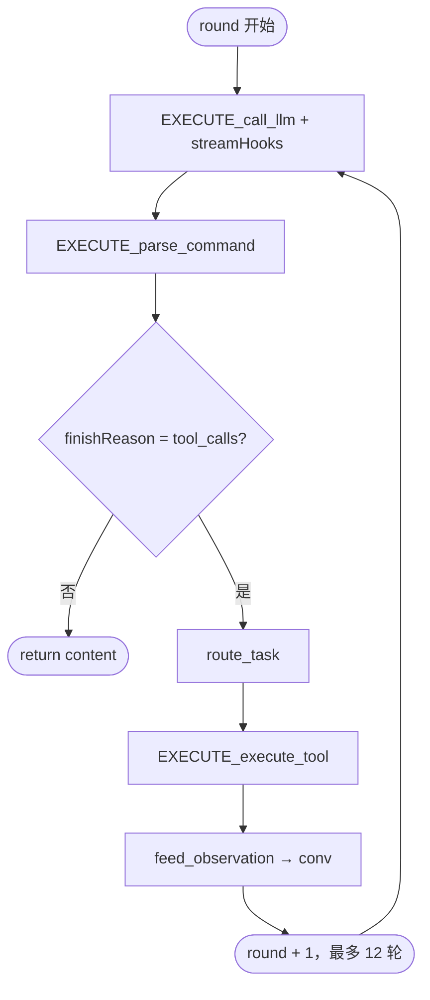

# Agent Loop（agent-loop）

**职责**：App 内 **Agent 多轮编排**（LangGraph 风格五节点）。不含 Volc HTTP/SSE 实现，也不直接执行 MCP 沙箱。

**入口**：`runAppAgentLoop` — 由 `pecado/js/agent/router.js` 在 **agent 模式**（MCP 已连接）下调用。

---

## 近期架构：LLM 自行编排（非本地脚本排队）

旧方案曾用 Observer / `tool_sequence` 等本地步骤队列；**已全部移除**。当前原则：

| 原则 | 实现 |
|------|------|
| **理解用户意图** | `capability-prompt.js` 注入能力清单与编排示例；LLM 自选 tools 与顺序 |
| **多轮 / 多任务** | `for` 循环最多 12 轮；每轮 INFER → tool_calls → FEED → 再 INFER |
| **结束信号** | `finish_task(summary)`（`finish-tool.js`）；本地不替 LLM 决定「做完没」 |
| **勿只说话** | 无 tool 的纯文字会收到 `FINISH_NUDGE`，避免「你好」无限循环（`shouldReturnPlainTextReply`） |
| **写码后短路** | `write_file` / `codx_edit` 成功可一轮返回（`agent-reply.js`），省 token |
| **xcode_run 前落盘** | `codx-disk-sync.js` 在 run 前 flush Monaco 计划/流到磁盘 |

Prompt 明确：**本地不会替你排队**；改码 + 运行等组合由模型在一轮或多轮内自行编排。

---

## 思考 vs 正文：SSE 双流显示

火山思考模型 SSE 含两字段（`llm-server/stream.js`）：

| 字段 | IPC phase | UI 展示 |
|------|-----------|---------|
| `delta.reasoning_content` | `reasoning_delta` | **思考**（CodX 第三行流光；主对话 INFER 详情） |
| `delta.content` | `delta` | **正文** markdown 气泡 |

此前只读 `content`，导致推理丢失或误进正文气泡。修复后 Agent 运行中 `delta` 不再拆掉 CodX 三行状态 UI；`tool_stream` 不进 markdown 气泡。

流式正文渐显：`shared/stream-text-reveal.js`（主对话 + CodX 底栏，思考区不变）。

---

## 重要概念：不是「监听 loop」

`agent-loop` **不会**订阅 EventEmitter、也不会用 IPC 去「监听一个 loop 对象」。

它是一条主进程里的 **同步编排循环**：

```js
for (let round = 0; round < MAX_TOOL_ROUNDS; round += 1) {
  // INFER → PARSE →（若有 tool_calls）DISPATCH → EXEC → FEED → 下一轮
}
```

每一轮都是 **主动 `await` 调用** 各模块的 `EXECUTE_*` / `FEED_*`；只有 INFER 阶段在消费 LLM **SSE 流**时，通过 **`streamHooks` 回调** 把增量推到 UI / Xcode（旁路，不驱动 loop 是否继续）。

---

## 调用链

```
渲染进程 pecado/js/index.js
  invoke VOLC_ARK.BOTS_CHAT_COMPLETION { streamId, userText, history }
  onVolcArkStreamEvent(streamId)     ← 流式 delta 旁路

主进程 pecado/js/agent/router.js
  selectChatMode → agent
  createUiStreamSink(sender, streamId)
  runAppAgentLoop(uiSink, apiKey, model, messages, loopOpts)

agent-loop/app-agent-loop.js
  for 轮 … → llm-server / mcp-filesystem
  return { content } | { error }
```

`invoke` 会 **等到整个 loop 跑完** 才返回最终 `{ content }`；中间的 token / write_file 增量靠 `BOTS_STREAM_EVENT` 推送。

---

## 每轮五节点

| 节点 | 位置 | 入口（Loop 调用） | 出口（回 Loop） |
|------|------|-------------------|-----------------|
| **INFER** | `llm-server/llm-infer-service.js` | `EXECUTE_call_llm(chatOpts, hooks)` | `FEED_infer_round` |
| **PARSE** | `llm-server/command-parser.js` | `EXECUTE_parse_command` | `FEED_parsed_command` |
| **DISPATCH** | `agent-loop/task-dispatcher.js` | — | `route_task(parsedTask)` |
| **EXEC** | `mcp-filesystem/tool-executor.js` | `EXECUTE_execute_tool(routed, opts)` | `FEED_tool_result` |
| **FEED conv** | `agent-loop/context-feeder.js` | — | `feed_assistant_tool_calls` / `feed_observation` |

约定：`EXECUTE_*` / `FEED_*` 只出现在 **业务模块**；Loop 内部用普通动词（`route_task`、`feed_observation`）。

### 一轮流程



- **`finishReason !== 'tool_calls'`** 或 **无 tasks**：返回 `parsed.content`，loop 结束。
- **有 tool_calls**：执行 tools 后：
  - 若含 **`write_file` / `edit_file`**：写入 `conv` 后 **不再进入下一轮 INFER**；`agent-reply.js` 拼装摘要返回。
  - 若仅 **`xcode_build` / `xcode_run` / `xcode_test`**：执行完即返回，不再下一轮 LLM。
  - **其余**（读文件、列目录等）：`feed_observation` → 下一轮 INFER。
- **超过 `MAX_TOOL_ROUNDS`（12）**：返回错误。

---

## Token 消耗优化（写代码路径）

| 旧行为 | 新行为 |
|--------|--------|
| 写代码后模型常再调 build/run → 多轮 LLM | 写代码后 **短路返回**（`agent-reply.js`） |
| 同轮 read+write 用过期 content | `write-guard.js` 强制先 read，write 延后一轮 |
| 已有文件 write 不读磁盘 | 写入前须 `read_file`（自动或模型调用） |

实现：`write-guard.js` + `agent-reply.js` + `app-agent-loop.js`。详见根目录 [README.md](../../README.md)「Token 消耗优化」。

---

## 流式旁路：stream-hooks + uiSink

Loop 每轮开始时创建 hooks（`stream-hooks.js` → `createAgentStreamHooks`）：

| Hook | 作用 |
|------|------|
| `onReasoningDelta` | 推理增量 → `reasoning_delta`（思考 UI） |
| `onTextDelta` | 正文增量 → `delta`（markdown 气泡） |
| `onTool` | tool 开始（非 write_file 流）→ `uiSink.onTool` |
| `onWriteFilePath` / `onWriteFileContentDelta` | `write_file` 参数流式解析 → 磁盘 + `uiSink.onToolStream` |
| `onRoundEnd` | 本轮 SSE 结束，收尾 Xcode writer |

`EXECUTE_call_llm` 内部：

```js
for await (const ev of streamChat(chatOpts)) {
  if (ev.type === 'text_delta') streamHooks.onTextDelta?.(ev.text);
  // tool_call_delta → write_file 解析器 或 onTool
  if (ev.type === 'round_complete') return { finishReason, toolCalls, ... };
}
```

### uiSink → 渲染进程

`pecado/js/agent/stream-ui.js` 的 `createUiStreamSink` 通过 **`sender.send(VOLC_ARK.BOTS_STREAM_EVENT, { streamId, phase, ... })`** 推送：

| phase | 含义 |
|-------|------|
| `reasoning_delta` | 思考流（`reasoning_content`） |
| `delta` | 正文增量（`content`） |
| `tool_stream` | write_file 内容增量 |
| `tool` | tool 调用通知 |
| `agent_log` | Agent 阶段 / Skill 执行日志 |
| `error` | 错误 |

Preload：`onVolcArkStreamEvent` → `ipcRenderer.on(BOTS_STREAM_EVENT)`。  
Renderer：发消息前订阅，用 **`streamId` 过滤**，只更新当前气泡。

---

## 模块文件

| 文件 | 职责 |
|------|------|
| `app-agent-loop.js` | `runAppAgentLoop`：for 轮编排、MCP + Skill + Xcode + finish_task |
| `finish-tool.js` | `finish_task` 工具与结束 nudge |
| `capability-prompt.js` | Agent system：能力清单 + LLM 自行编排说明 |
| `codx-disk-sync.js` | xcode_run 前 Monaco 流式内容落盘 |
| `agent-reply.js` | 写代码后短路返回、拼装回复 |
| `write-guard.js` | 已有文件写入前强制 read_file；同轮 write 延后 |
| `task-dispatcher.js` | `route_task`：`mcp_tool` / `xcode_tool` / `dev_docs_tool` → skill |
| `context-feeder.js` | 把 assistant / tool 结果写入多轮 `conv` |
| `stream-hooks.js` | INFER 期间 UI + write_file 流式写盘 |
| `index.js` | 模块导出 |

---

## 依赖边界

```
pecado/router  →  agent-loop  →  llm-server
                              →  mcp-filesystem
                              →  xcode/stream（stream-hooks）
```

- **agent-loop 不 require pecado**（单向依赖）。
- **llm-server 不 require agent-loop**；副作用仅通过传入的 `streamHooks`。
- 扩展新 tool 类型：在 `task-dispatcher.js` 加 `case`，目标模块实现 `EXECUTE_*` / `FEED_*`，Loop 里对 `routed.module` 调用（或扩展现有 EXEC）。

### 提供给 LLM 的 Function 数量

| 来源 | 数量 |
|------|------|
| MCP `@modelcontextprotocol/server-filesystem` | 13 |
| `workflow/skill/agent/tools.js` | 5 |
| `xcode/agent/tools.js`（macOS） | 4 |
| **合计（macOS Agent）** | **22** |

完整工具名列表见根目录 [README.md](../../README.md)「LLM Function Calling」。

---

## 前置条件

- **File → Open Folder** 后 MCP 已连接（`projectIo.getStatus().connected`）。
- Preferences 中配置 Volc API Key。
- router 的 `selectChatMode` 在 MCP 连接时选择 **agent** 模式。

未连接 MCP 时走 **plain / context** 单轮（`plain-stream.js`），**不经过 agent-loop**。
