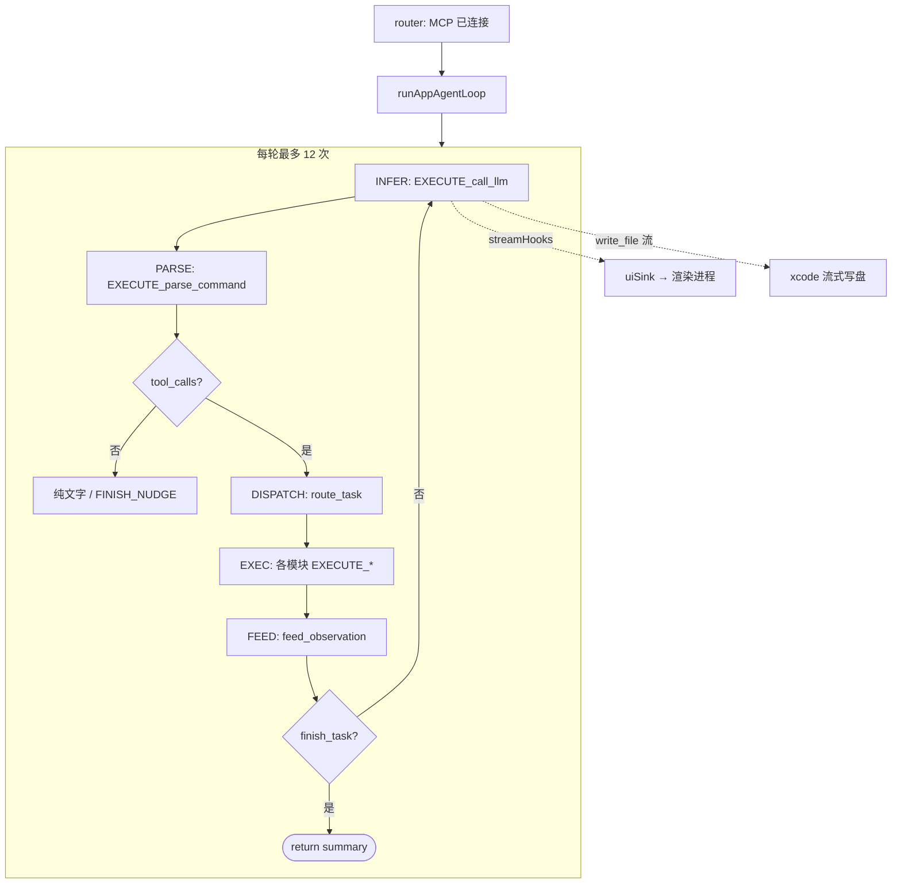
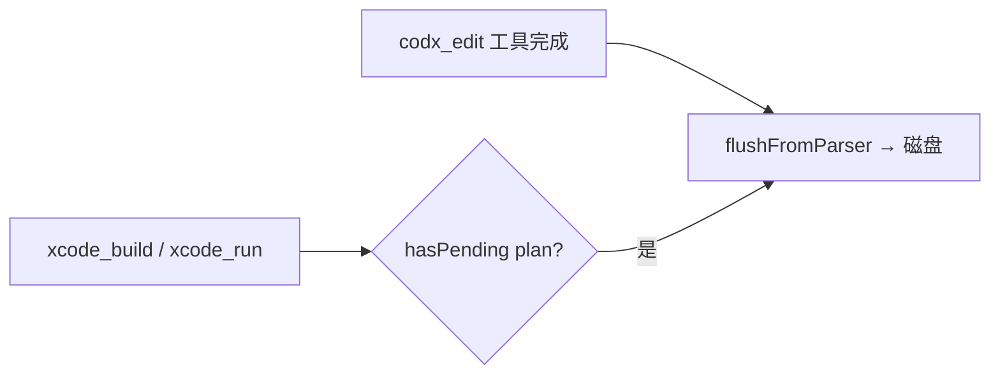

# Agent Loop（agent-loop）

**职责**：主进程内 **Agent 多轮编排**（LangGraph 风格五节点）。不含 Volc HTTP/SSE，也不直接跑 MCP 沙箱。

**入口**：`runAppAgentLoop(uiSink, llmOpts, messages, loopOpts)` — 由 `pecado/js/agent/router.js` 在 **agent 模式**下调用。

---

## 一图看懂



---

## 设计原则（LLM 自行编排）

旧方案 Observer / `tool_sequence` **已移除**。当前由模型自选 tools 与顺序：

| 原则 | 实现 |
|------|------|
| 理解意图 | `capability-prompt.js` + 工程锚点 |
| 多轮 | `MAX_TOOL_ROUNDS = 12` |
| 结束 | `finish_task(summary)` |
| 勿空转 | 无 tool 时 `FINISH_NUDGE`（闲聊可一轮结束） |
| 改码前 read | `write-guard.js` → `read_text_file` |
| CodX 落盘 | `codx-disk-sync.js`（见下） |

---

## 思考 vs 正文（SSE 双流）

| SSE 字段 | IPC phase | UI |
|----------|-----------|-----|
| `reasoning_content` | `reasoning_delta` | CodX「思考」流光 / 主对话 INFER 详情 |
| `content` | `delta` | markdown 正文气泡 |

CodX 底栏发 `codxChat: true` 时，router 注入 `prompt-language.js` 中文 reasoning 约束。

正文渐显：`shared/stream-text-reveal.js`（有 stream 时不被 `finish_task` summary 覆盖）。

---

## CodX 落盘时机



| 时机 | 行为 |
|------|------|
| `codx_edit` 成功后 | 尝试 flush 流式内容到磁盘 |
| `xcode_build` / `xcode_run` 前 | 若仍有 pending plan，再 flush |
| 流式进行中 | 非空文件只更新 Monaco + 对话代码块（deferred） |

---

## 五节点一览

| 节点 | 模块 | 入口 | 出口 |
|------|------|------|------|
| INFER | llm-server | `EXECUTE_call_llm` | `FEED_infer_round` |
| PARSE | llm-server | `EXECUTE_parse_command` | `FEED_parsed_command` |
| DISPATCH | agent-loop | — | `route_task` |
| EXEC | mcp / skill / codX / xcode | 各 `EXECUTE_*` | 各 `FEED_*` |
| FEED conv | agent-loop | — | `feed_observation` |

---

## 调用链

```
codx-chat.js / pecado/index.js
  invoke BOTS_CHAT_COMPLETION { streamId, userText, codxChat?, codxActiveFile? }
  onVolcArkStreamEvent(streamId)

router.js → runAppAgentLoop(uiSink, llmOpts, messages, loopOpts)

app-agent-loop.js
  for 轮 → llm-server / mcp / skill / codX / xcode
  return { content } | { error }
```

`invoke` **阻塞到 loop 结束**；中间增量走 `BOTS_STREAM_EVENT`。

---

## 模块文件

| 文件 | 职责 |
|------|------|
| `app-agent-loop.js` | 主循环、`messagesForInfer`（CodX 多轮语言提醒） |
| `finish-tool.js` | `finish_task` + `FINISH_NUDGE` |
| `capability-prompt.js` | Agent system 能力清单 |
| `codx-disk-sync.js` | CodX 编辑 flush 磁盘 |
| `write-guard.js` | `write_file` / `edit_file` 前强制 read |
| `task-dispatcher.js` | `route_task` 四类 type |
| `context-feeder.js` | 写 conv |
| `stream-hooks.js` | INFER 旁路 UI / 写盘 |
| `agent-reply.js` | 直调 Xcode 时拼回复 |

---

## Function 数量

| 来源 | 数量 |
|------|------|
| `finish_task` | 1 |
| MCP server-filesystem | 14（含废弃 `read_file`） |
| Skill | 5 |
| CodX | 2 |
| Xcode（macOS） | 4 |
| **合计 macOS** | **26** |
| **合计 非 macOS** | **22** |

完整工具表见根 [README.md](../../README.md)。

---

## 前置条件

1. **File → Open Folder** → MCP `connected`
2. Preferences 配置 Volc API Key
3. 未连 MCP → **plain / context** 单轮（`plain-stream.js`），不经过本模块
