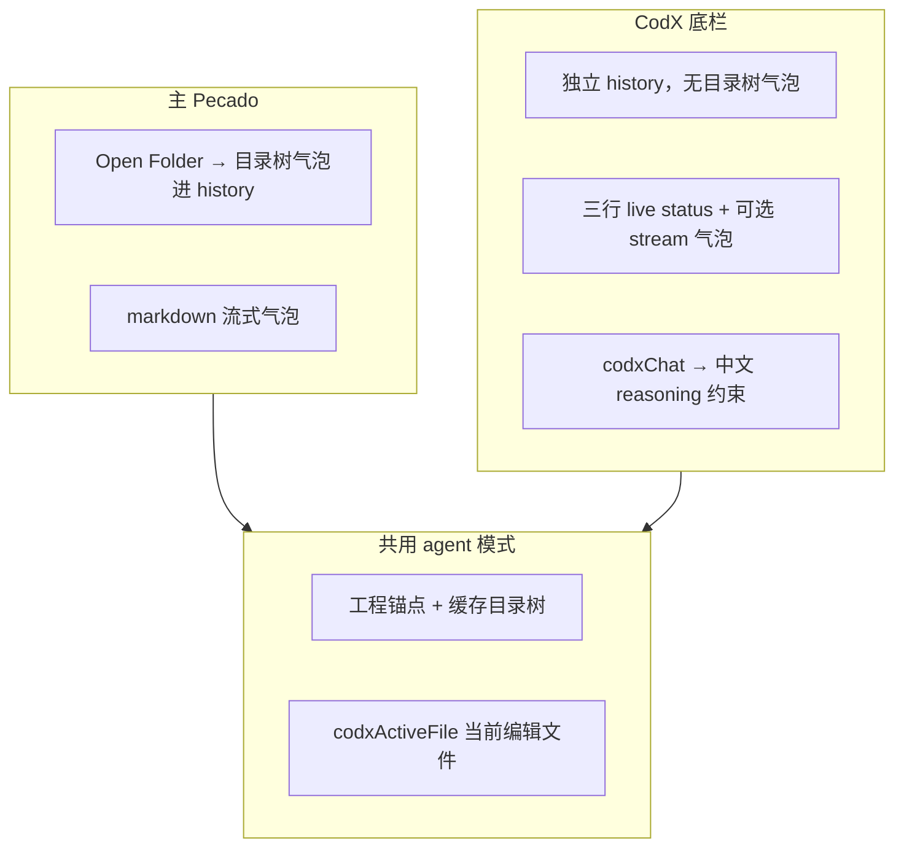

# CodX 模块

Monaco 代码编辑器：**文件树 + Tab 编辑区 + 底栏 Pecado / log**。与主 Pecado 共用 Agent IPC，但 UI 与 history 独立。

---

## 怎么进入

| 操作 | 效果 |
|------|------|
| 底栏 **打开编程** | 全屏 CodX（隐藏 Pecado / Workflow / Git 侧栏） |
| **关闭编程** | 回到进入前的侧栏视图 |
| 工程头点击 | Finder 打开当前工程根 |

---

## 目录结构

```
src/codX/
  css/index.css
  js/
    monaco-loader.js      Monaco AMD 加载
    file-tree.js          文件树（原子 swap，避免刷新闪空）
    editor.js             编辑区：Tab、流式改码、保存
    editor-themes.js      配色主题
    stream-bridge.js      Agent 流式 → Monaco（write_file / codx_edit）
    codx-chat.js          底栏对话（codxChat: true）
    codx-live-status.js   三行状态：历史 / 当前步 / 思考
    codx-log.js           底栏 log
    index.js              视图切换、⌘S、↥ 同步 Xcode
  agent/
    tools.js              codx_edit_plan / codx_edit（主进程）
    context.js            当前文件 + 语言块注入
  ipc.js                  语法检查 IPC
```

**共享模块**：`shared/codx-edit-*`、`stream-text-reveal.js`、`chat-scroll-follow.js`、`format-tree.js`、`prompt-language.js`

---

## 主 Pecado vs CodX 底栏



| 项 | 主 Pecado | CodX 底栏 |
|----|-----------|-----------|
| history | 主对话区 | `codx-chat.js` 独立 |
| 目录树展示 | chat 气泡 | 无（靠 system 锚点） |
| 流式 UI | markdown | 思考/步骤三行 + 正文气泡 |
| 语言 | 通用 Agent prompt | 额外 `CODX_CHAT_LANGUAGE_BLOCK` + 用户消息前缀 |

---

## AI 改码流程

```mermaid
sequenceDiagram
  participant LLM
  participant Loop as agent-loop
  participant Editor as Monaco
  participant Disk as 磁盘

  LLM->>Loop: read_text_file
  LLM->>Loop: codx_edit_plan(path, line_start…)
  Loop->>Editor: 登记 plan，高亮行
  LLM->>Loop: codx_edit 流式 text
  Loop->>Editor: stream-bridge 实时追加
  Note over Editor: 非空文件：deferred，流式只改编辑器
  Loop->>Disk: codx_edit 结束 → codx-disk-sync flush
  Note over Disk: xcode_build/run 前若仍有 pending 再 flush
  Editor->>Disk: 用户 ⌘S 或 ↥ 同步 Xcode
```

| 步骤 | 工具 / 操作 | 说明 |
|------|-------------|------|
| 1 | `read_text_file` | 读磁盘最新内容 |
| 2 | `codx_edit_plan` | `path` + `edits[]`（仅 `line_start`，大行号在前） |
| 3 | `codx_edit` | 流式 `text`，段间 `pecado_LLM_line_end` |
| 4 | 编辑器 | 按段实时显示 |
| 5 | flush | 工具结束后写盘；编译/运行前可能再 flush |
| 6 | ⌘S / ↥ | 手动保存或同步到 Xcode 工程 |

空文件或 `write_file` 仍可流式直接写磁盘（经 `stream-hooks`）。

---

## Preferences（通用）

| 设置 | 说明 |
|------|------|
| CodX 编辑器配色 | pecado-dark / cursor-dark / xcode-dark 等 |
| CodX 字号 | 0 = 主题默认 |
| CodX 行号 | 显示 / 隐藏 / 相对行号 |
| CodX 行号栏宽度 | 2–6 字符 |
| CodX 行号字号 / 粗细 | 可独立于代码区 |

---

## 依赖关系

- **Open Folder** → MCP 工程根、`directory_tree` / `read_text_file`
- **保存** → `mcp-fs-write-text-file`（⌘S、↥）
- **对话** → `VOLC_ARK.BOTS_CHAT_COMPLETION`（`codxChat: true`）→ 共用 `router` / `agent-loop`
