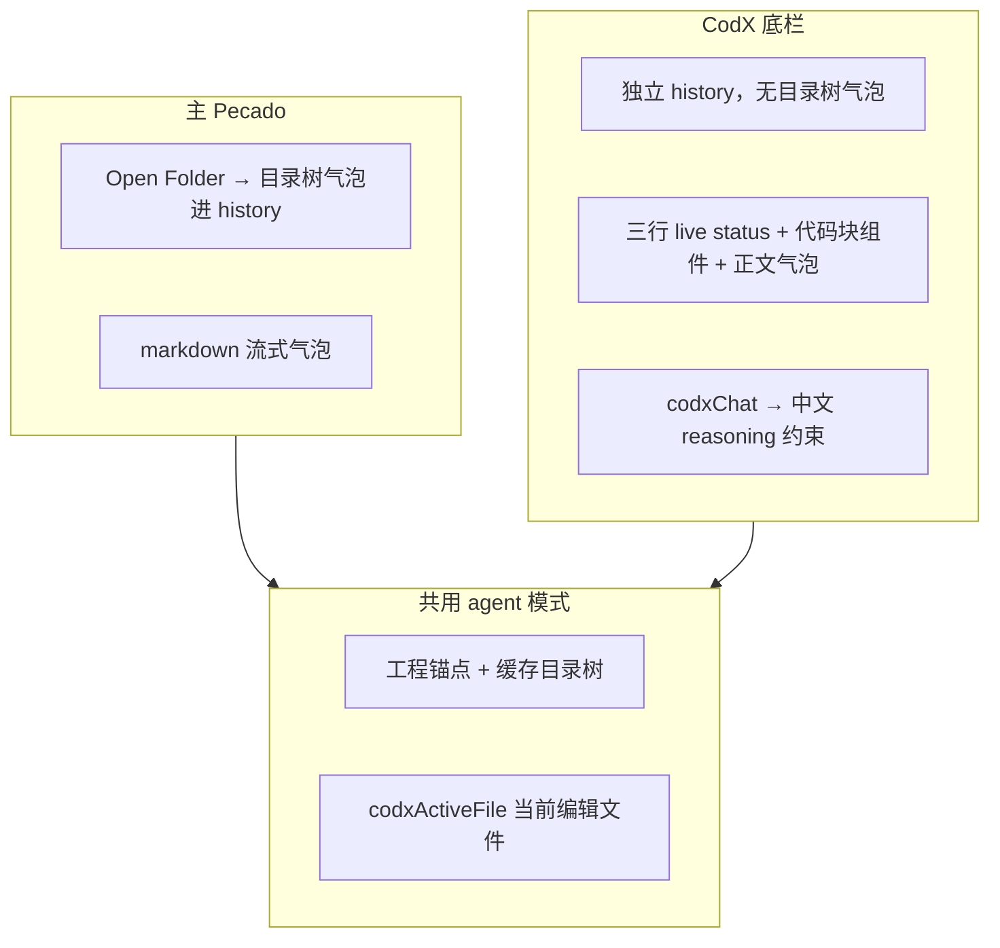

# CodX 模块

Monaco 代码编辑器：**文件树 + Tab 编辑区 + 底栏 Pecado / log**。与主 Pecado 共用 Agent IPC，但 UI 与 history 独立。

---

## 怎么进入

| 操作 | 效果 |
|------|------|
| 底栏 **打开编程** | 全屏 CodX（隐藏 Pecado / Workflow / Git 侧栏） |
| **关闭编程** | 回到进入前的侧栏视图 |
| 工程头点击 | Finder 打开当前工程根 |

---

## 目录结构

```
src/codX/
  css/index.css
  js/
    monaco-loader.js      Monaco AMD 加载
    file-tree.js          文件树（原子 swap，避免刷新闪空）
    editor.js             编辑区：Tab、流式改码、保存
    editor-themes.js      配色主题
    stream-bridge.js      Agent 流式 → Monaco（write_file / codx_edit）
    codx-code-block.js    对话内代码流展示（持久化在 history）
    codx-chat.js          底栏对话（codxChat: true）
    codx-live-status.js   三行状态：历史 / 当前步 / 思考
    codx-log.js           底栏 log
    codx-edit-plan.js     浏览器端 plan 切分（与 shared 一致）
    codx-edit-ops.js      浏览器端行级编辑（与 shared 一致）
    index.js              视图切换、⌘S、↥ 同步 Xcode
  agent/
    tools.js              codx_edit_plan / codx_edit（主进程）
    context.js            当前文件 + 语言块注入
  ipc.js                  语法检查 IPC
```

**共享模块（主进程 / Node）**：`shared/codx-stream-ops.js`、`shared/codx-edit-plan.js`、`shared/codx-edit-ops.js`

**其它共享**：`stream-text-reveal.js`、`chat-scroll-follow.js`、`format-tree.js`、`prompt-language.js`

---

## 主 Pecado vs CodX 底栏



| 项 | 主 Pecado | CodX 底栏 |
|----|-----------|-----------|
| history | 主对话区 | `codx-chat.js` 独立 |
| 目录树展示 | chat 气泡 | 无（靠 system 锚点） |
| 流式 UI | markdown | 思考/步骤三行 + **代码块组件** + 正文气泡 |
| 语言 | 通用 Agent prompt | 额外 `CODX_CHAT_LANGUAGE_BLOCK` + 用户消息前缀 |

---

## AI 改码流程（两轮协议）

```mermaid
sequenceDiagram
  participant LLM
  participant Loop as agent-loop
  participant Chat as codx-code-block
  participant Editor as Monaco
  participant Disk as 磁盘

  LLM->>Loop: read_text_file
  LLM->>Loop: codx_edit_plan(path, edits[])
  Loop->>Editor: 登记 plan
  Loop->>Chat: 展示 plan 段（L行 · op · 区间）
  LLM->>Loop: codx_edit 流式 text
  Loop->>Editor: stream-bridge 实时写入
  Loop->>Chat: 流式更新代码块（持久保留在 history）
  Note over Editor: insert_code/edit_code 实时；del_code/insert_blanks 段完成一次
  Loop->>Disk: codx_edit 结束 → codx-disk-sync flush
  Note over Disk: xcode_build/run 前若仍有 pending 再 flush
  Editor->>Disk: 用户 ⌘S 或 ↥ 同步 Xcode
```

| 步骤 | 工具 / 操作 | 说明 |
|------|-------------|------|
| 1 | `read_text_file` | 读磁盘最新内容 |
| 2 | `codx_edit_plan` | `path` + `edits[]`（**大行号在前**） |
| 3 | `codx_edit` | 流式 `text`，与 plan 段序一致，段末 `pecado_block_end` |
| 4 | Monaco | 按段实时显示（协议关键词不写入编辑器） |
| 5 | 对话组件 | 按段展示，**回合结束后仍保留在 history** |
| 6 | flush | 工具结束后写盘；编译/运行前可能再 flush |
| 7 | ⌘S / ↥ | 手动保存或同步到 Xcode 工程 |

---

## Plan 操作（`codx_edit_plan`）

均从 `line_start` **本行**开始（非「下方插入」）。

| op | 含义 | line_end |
|----|------|----------|
| `insert_code` | 本行插入代码 | 不需要 |
| `edit_code` | 本行编辑（本地先删区间再插入） | 必填 |
| `del_code` | 删除行区间 | 必填 |
| `insert_blanks` | 本行起插入空行 | 必填 |

---

## 流式段格式（`codx_edit`）

与 plan 段序一一对应，段末均为 `pecado_block_end`：

```
insert_code
代码...
pecado_block_end

edit_code
代码...
pecado_block_end

del_code
pecado_block_end

insert_blanks
pecado_block_end
```

- **有代码段**：`insert_code`、`edit_code` — 流中带代码；Monaco 与对话组件实时显示
- **无代码段**：`del_code`、`insert_blanks` — 流中无代码，区间仅 plan 取；Monaco 段完成时一次应用
- **`edit_code` 本地展开**：先 `del_code` 删 plan 区间，再 `insert_code` 从 start 插入流代码

---

## 对话内代码块（`codx-code-block.js`）

Cursor 风格展示，**纯展示**，不参与写 Monaco / 写盘：

| 展示 | 示例 |
|------|------|
| 插入 | `L24 · insert_code` + 代码流 |
| 编辑 | `L25 · edit_code · 25-27` + 代码流 |
| 删除 | `L25 · del_code · 25-27`（无代码块） |
| 空行 | `L10 · insert_blanks · 10-12`（无代码块） |

- 挂载在 `#codx-chat-scroll` 独立消息行，**不随思考行移除**
- 段切换时滚到对应 section；过长时在组件内跟随滚动

---

## 空文件 / 新建文件

| 场景 | 路径 |
|------|------|
| **空文件 / 新建** | `write_file` → `xcode/stream.js` 直接写磁盘（不经 codx_edit） |
| **已有代码** | 必须用 `codx_edit_plan` → `codx_edit`；`write_file` 覆盖会被拒绝 |

非空文件流式阶段：**deferred**，只改 Monaco，工具结束后 flush 磁盘。

---

## Preferences（通用）

| 设置 | 说明 |
|------|------|
| CodX 编辑器配色 | pecado-dark / cursor-dark / xcode-dark 等 |
| CodX 字号 | 0 = 主题默认 |
| CodX 行号 | 显示 / 隐藏 / 相对行号 |
| CodX 行号栏宽度 | 2–6 字符 |
| CodX 行号字号 / 粗细 | 可独立于代码区 |

---

## 依赖关系

- **Open Folder** → MCP 工程根、`directory_tree` / `read_text_file`
- **保存** → `mcp-fs-write-text-file`（⌘S、↥）
- **对话** → `VOLC_ARK.BOTS_CHAT_COMPLETION`（`codxChat: true`）→ 共用 `router` / `agent-loop`
