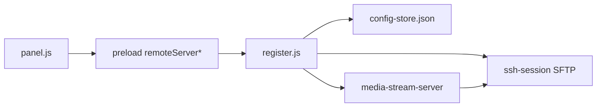

# RemoteServer（远程文件 / FTP 式管理）

侧栏 **RemoteServer**：经 **SSH/SFTP** 连接远端服务器，浏览目录树、预览/编辑文件、上传下载。交互类似图形化 FTP，底层是 SFTP（`ssh2`），不是经典 FTP 协议。

---

## 怎么进入

| 操作 | 效果 |
|------|------|
| 侧栏 **RemoteServer** | 打开面板；有已存账号时尝试自动登录 |
| **登录** | SSH 连接成功后进入浏览器区 |
| **断开** | 结束会话，回到登录页 |

---

## 目录结构

```
src/remoteServer/
  README.md                 本说明
  config-store.js           本机配置 → userData/remote-server.json
  ssh-session.js            SSH/SFTP 会话（主进程单例）
  media-stream-server.js    本机 HTTP：媒体 Range 流式预览
  register.js               IPC 注册 / 上传任务编排 / 对话框
  html/panel.html           面板 DOM
  css/index.css             面板样式（滚动条、分割条、登录卡）
  js/panel.js               渲染层：树、预览、上传下载、Monaco
```

**接入点**：

| 位置 | 作用 |
|------|------|
| `shared/ipc-channels.js` → `REMOTE_SERVER.*` | IPC 通道名 |
| `preload/preload.js` → `remoteServer*` | 渲染进程 API |
| `main/js/main.js` | `register` / `shutdown` |
| `main/html/index.html` | 侧栏入口 + 挂载点 + CSS/JS |
| `gitgraph/js/index.js` | `showView('remote-server')` |

依赖：`package.json` → `ssh2`。

---

## 功能一览（今日开发）

### 连接与配置

- SSH 账号表单（主机 / 端口 / 用户名 / 密码），居中登录卡
- 登录信息持久化到 `~/Library/Application Support/pecado/remote-server.json`（或对应平台 userData）
- 进入模块时恢复上次路径、展开节点、选中项；可自动重连

### 目录树

- 可展开文件夹树；展开时在**对应子节点位置**显示加载动画
- 选中文件/文件夹高亮；文件夹预览区显示文件数 / 文件夹数
- 树状态（`lastPath` / `treeExpanded` / `selectedPath`）写入配置
- 与预览区之间可左右拖动分割，宽度记入 `localStorage`

### 文件预览与编辑

- 文本 / 代码：在线打开；代码类扩展名用 **Monaco** 语法高亮（与 CodX 共用 loader/主题），可编辑保存
- 图片 / 音视频 / PDF：媒体预览；音视频优先本机 HTTP **Range 流式**（不必整文件下载）
- 二进制大文件等限制见 `ssh-session` 读写逻辑

### 下载

- 「下载到」本机目录可配置（默认桌面）；与「上传路径」同一行
- 选中文件后点「下载」保存到该目录

### 上传

- 「上传路径」：拖拽或「选择…」暂存本地文件/文件夹（支持选文件夹）
- 仅暂存路径，点「上传」才真正传到当前远程目录
- 上传中按钮变为「撤销」，可取消进行中的上传
- 暂存列表持久化到配置

### 其它操作

- 刷新 / 上级目录 / 路径栏跳转
- 新建文件夹
- 删除（需在弹窗输入 `del` 确认）

### UI

- 滚动条样式与主应用（main / workflow）一致
- 窄屏下树与预览改为上下布局，分割条隐藏

---

## 配置字段（remote-server.json）

| 字段 | 含义 |
|------|------|
| `host` / `port` / `username` / `password` | SSH 登录 |
| `lastPath` | 上次浏览/选中相关路径 |
| `downloadDir` | 本机下载目录 |
| `uploadItems` | 待上传本地项 `{ path, relativePath }` |
| `treeExpanded` | 已展开远程目录路径列表 |
| `selectedPath` / `selectedIsDir` | 上次选中项 |

---

## 主要 IPC

| 通道 | 用途 |
|------|------|
| `CONNECT` / `DISCONNECT` / `GET_STATE` | 连接与状态 |
| `LIST_DIR` / `READ_FILE` / `WRITE_FILE` / `DELETE` / `MKDIR` | 远端文件操作 |
| `UPLOAD` / `CANCEL_UPLOAD` / `PICK_UPLOAD_FILES` / `SET_UPLOAD_PATH` | 上传 |
| `DOWNLOAD` / `PICK_DOWNLOAD_DIR` / `SET_DOWNLOAD_DIR` | 下载 |
| `PREVIEW_MEDIA` | 媒体预览 URL |
| `SAVE_TREE_STATE` | 持久化树展开与选中 |
| `GET_PANEL_HTML` | 加载面板 HTML |

---

## 数据流（简图）



---

## 开发注意

- 改 `panel.html` 结构后，请递增 `panel.js` 里的 `PANEL_VERSION`，否则挂载点会沿用旧 HTML
- 改 `preload` / `register` / `config-store` 后需重启 `npm run dev`
- Electron 42+ 渲染进程拿不到 `file.path`，拖拽路径经 preload `getPathForFile`（`webUtils`）解析
