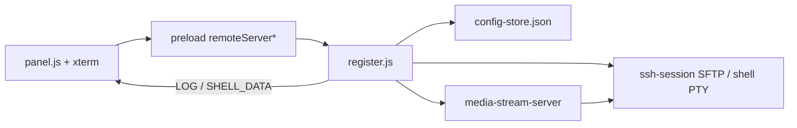

# RemoteServer（远程文件 / SFTP 管理）

侧栏 **RemoteServer**：经 **SSH/SFTP** 连接远端 Linux 服务器，图形化浏览目录树、预览/编辑文件、上传下载，并内置 **交互式 Shell**（xterm + SSH PTY）。交互类似 FTP 客户端，底层是 SFTP（`ssh2`），**不是**经典 FTP 协议。

---

## 怎么进入

| 操作 | 效果 |
|------|------|
| 侧栏 **RemoteServer** | 打开面板；有已存账号时尝试自动登录 |
| **登录** | SSH 连接成功后进入文件浏览区 |
| **断开** | 结束会话（含 Shell PTY），回到登录页 |

---

## 目录结构

```
src/remoteServer/
  README.md                 本说明
  config-store.js           本机配置 → userData/remote-server.json
  ssh-session.js            SSH/SFTP 会话 + 交互 Shell PTY（主进程单例）
  media-stream-server.js    本机 HTTP：媒体 Range 流式预览
  register.js               IPC 注册 / 上传任务编排 / 对话框
  html/panel.html           面板 DOM（含 Shell 分区）
  css/index.css             面板样式（滚动条、分割条、Shell dock）
  js/panel.js               渲染层：树、预览、上传下载、Monaco、xterm
```

**接入点**：

| 位置 | 作用 |
|------|------|
| `shared/ipc-channels.js` → `REMOTE_SERVER.*` | IPC 通道名（含 `SHELL_*`） |
| `preload/preload.js` → `remoteServer*` / `onRemoteServerShell*` | 渲染进程 API |
| `main/js/main.js` | `register` / `shutdown` |
| `main/html/index.html` | 侧栏入口 + 挂载点 + CSS/JS；**xterm 须在 Monaco AMD loader 之前加载** |
| `gitgraph/js/index.js` | `showView('remote-server')` |

依赖：`package.json` → `ssh2`、`@xterm/xterm`、`@xterm/addon-fit`。

---

## 功能一览

### 连接与配置

- SSH 账号表单（主机 / 端口 / 用户名 / 密码），居中登录卡
- 登录信息持久化到 `userData/remote-server.json`（各平台 Application Support 目录）
- 进入模块时恢复上次路径、展开节点、选中项；可自动重连
- 初始化/登录后**定位到上次选中项**：展开路径 → 加载动画 → 滚到视口上方约 **1/3** 处

### 传输栏（下载到 | 上传文件）

- 顶栏：**「下载到」** / **「上传文件」** 按钮 + 只读路径文字
- **下载到**：选择本机保存目录；默认桌面
- **上传文件**：点击或拖拽暂存待上传项；点工具栏 **上传** 才传到当前远程目录
- 暂存列表持久化到配置

### 目录树

- 可展开文件夹树；展开时在**对应子节点位置**内联加载动画
- 选中文件/文件夹高亮；文件夹预览区显示文件数 / 文件夹数
- 树状态（`lastPath` / `treeExpanded` / `selectedPath`）写入配置
- 与预览区之间可**左右拖动分割**；宽度写入 `localStorage` + 配置 `treeWidth`
- 上传/删除完成后**只刷新父目录对应节点**（不全量重建整棵树）
- 工具栏 **关闭**：折叠全部展开，回到根目录并清空选中/预览

### 文件预览与编辑

- 文本 / 代码：Monaco 语法高亮（与 CodX 共用 loader/主题），可编辑保存
- **多文件本地草稿**（`fileDrafts`）：切换文件/目录不弹确认；脏文件树节点显示「未保存」
- 保存按钮为预览区右上角浮动按钮；**刷新**丢弃全部草稿并重新同步
- 图片 / 音视频 / PDF：媒体预览；音视频优先本机 HTTP **Range 流式**
- 二进制大文件等限制见 `ssh-session` 读写逻辑

### 交互 Shell（xterm + SSH PTY）

- 工具栏 **Shell**：打开/关闭预览下方终端面板（风格对齐 Pecado skill-log dock）
- 地址条：显示当前 cwd；**兼作预览↔Shell 分割条**（可拖高度）；**切换** → `cd` 到当前选中目录（文件则进父目录）
- 打开时默认 cwd：当前打开文件的父目录，否则选中项/当前路径
- 主进程 `ssh2` `client.shell()` 交互 PTY；渲染层 xterm（Courier、可调字号/行高）
- 支持交互程序、Ctrl+C、补全等（非逐行 exec）
- 断开连接或关闭 Shell 时结束 PTY

### 下载

- 选中文件或文件夹后点 **下载**，保存到「下载到」目录
- 文件夹优先 **tar 经 SSH 管道**打包下载，失败回退 SFTP 递归；保留目录结构

### 上传

- 文件夹优先 **tar 经 SSH 管道**一次性上传；失败回退 SFTP 逐文件
- 上传中按钮变为 **撤销**，可取消（含 tar 传输）
- 成功后选中上传项（单文件选文件，文件夹选顶层目录）
- 底栏 SFTP 日志 + **进度条**；父目录节点与底栏显示**加载菊花**

### 删除与其它

- **删除**：弹窗输入 `del`，须**点击「删除」按钮**确认（回车不触发）
- 删除优先远端 `rm -rf` / `rm -f`，失败回退 SFTP 递归删
- 删除后选中并预览**上一级目录**
- 刷新 / 路径栏跳转、新建文件夹

### UI

- 底栏单行 SFTP 风格日志（`REMOTE_SERVER.LOG`）
- 滚动条样式与主应用一致
- 窄屏下树与预览改为上下布局

---

## 配置字段（remote-server.json）

| 字段 | 含义 |
|------|------|
| `host` / `port` / `username` / `password` | SSH 登录 |
| `lastPath` | 上次浏览路径 |
| `downloadDir` | 本机下载目录 |
| `uploadItems` | 待上传本地项 `{ path, relativePath }` |
| `treeExpanded` | 已展开远程目录路径列表 |
| `selectedPath` / `selectedIsDir` | 上次选中项 |
| `treeWidth` | 树/预览分屏宽度（px） |

---

## 主要 IPC

| 通道 | 用途 |
|------|------|
| `CONNECT` / `DISCONNECT` / `GET_STATE` | 连接与状态 |
| `LIST_DIR` / `READ_FILE` / `WRITE_FILE` / `DELETE` / `MKDIR` | 远端文件操作 |
| `UPLOAD` / `CANCEL_UPLOAD` / `PICK_UPLOAD_FILES` / `SET_UPLOAD_PATH` | 上传 |
| `DOWNLOAD` / `PICK_DOWNLOAD_DIR` / `SET_DOWNLOAD_DIR` / `CANCEL_DOWNLOAD` | 下载 |
| `PREVIEW_MEDIA` | 媒体预览 URL |
| `SAVE_TREE_STATE` | 持久化树展开、选中、分屏宽度 |
| `SHELL_OPEN` / `SHELL_WRITE` / `SHELL_RESIZE` / `SHELL_CLOSE` | 交互 PTY |
| `SHELL_DATA` / `SHELL_EXIT` | 主进程 → 渲染：输出 / 结束 |
| `SHELL_EXEC` | 一次性远端命令（兼容，面板主路径已改用 PTY） |
| `LOG` | 主进程 → 渲染进程 SFTP 日志（含进度 `{ done, total }`） |
| `GET_PANEL_HTML` | 加载面板 HTML |

---

## 数据流



---

## 开发注意

- 改 `panel.html` 结构后，递增 `panel.js` 里的 `PANEL_VERSION`
- 改 `preload` / `register` / `config-store` / `ssh-session` 后需**重启** `npm run dev`
- **xterm 必须在 Monaco `loader.js` 之前引入**（否则 AMD `define` 会劫持 UMD，出现「xterm 未加载」）
- Electron 42+ 拖拽路径经 preload `getPathForFile`（`webUtils`）解析
