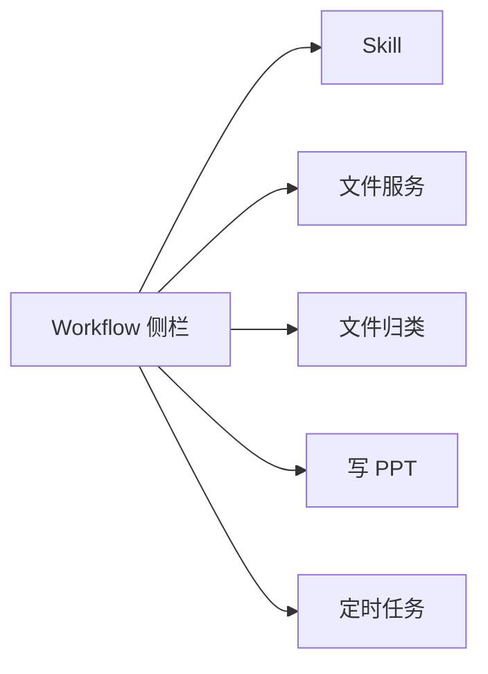

# Workflow 模块

Workflow 侧栏：**五个 Tab**，各对应一块能力。

## Tab → 代码

| Tab | 目录 / 文件 | 功能 |
|-----|-------------|------|
| **Skill** | `skill/` | Skill 文档、Layer 树、Agent tools |
| **文件服务** | `file-service/server.js` | 局域网 HTTP 共享（进 Tab 可自动启动） |
| **文件归类** | `services/organize.js` | 顶层文件按类型分子目录 |
| **写 PPT** | `services/ppt.js` | Markdown 大纲 → `workflow-output/ppt/` |
| **定时任务** | `services/schedule.js` | 定时打开本机应用 |

详见 [skill/README.md](./skill/README.md)、[file-service/README.md](./file-service/README.md)、[services/README.md](./services/README.md)。
