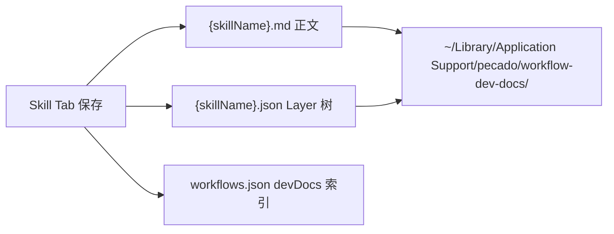
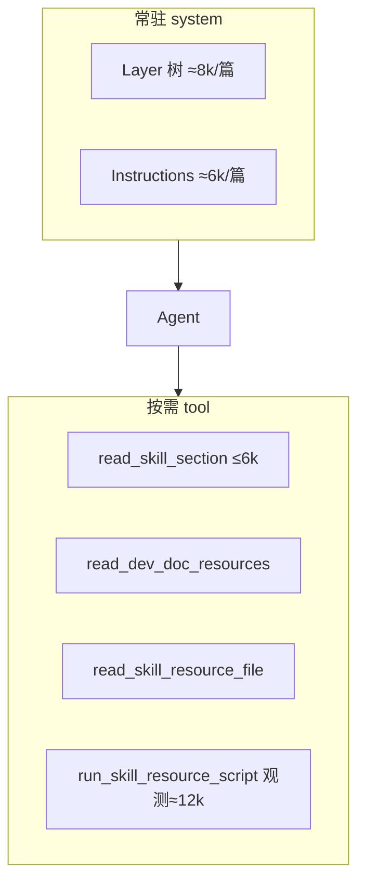

# Skill 模块

Workflow 侧栏 **Skill** Tab：编辑、保存、勾选「加入 AI」后供 Agent 按需读取。

> **命名说明**：UI 称 **Skill**；索引字段仍为 `workflows.json` → `devDocs`（历史命名）。

---

## 数据落在哪里



| 路径 | 内容 |
|------|------|
| `workflow-dev-docs/{skillName}.md` | Metadata + Instructions + Resources **正文** |
| `workflow-dev-docs/{skillName}.json` | Layer 树（仅 path/label，无正文） |
| `workflows.json` → `devDocs[]` | 列表、勾选状态、`aiContextMode` |

---

## 代码目录

```
skill/
  service.js       列表/保存/删除 IPC
  store.js         读写 .md / .json
  resources.js     附属资源目录、脚本执行
  document.js      三段式组装、frontmatter
  generate.js      URL/文件/手写 → Skill
  llm-meta.js      LLM 补全 name/description
  agent/
    context.js     注入 system（Layer 树 + Instructions）
    tools.js       read_skill_* / run_skill_resource_script
  index.js         门面
```

---

## Agent 怎么读 Skill



| 内容 | 默认进 system？ | 怎么读 |
|------|----------------|--------|
| Layer 树 | 是 | 已有则勿调 `read_skill_layer` |
| Instructions | 是（若有） | — |
| Resources 正文 | 否 | `read_skill_section` / `read_dev_doc_resources` |
| 整份 .md | 仅「原文」模式 full | 全文注入（≈120k/篇） |

---

## 相关入口

| 位置 | 作用 |
|------|------|
| `../register.js` | `WORKFLOW.DEV_DOCS_*` IPC |
| `pecado/js/agent/router.js` | `buildDevDocsContextForAi()` |
| `agent-loop/task-dispatcher.js` | `dev_docs_tool` → module `skill` |

UI：`../html/panel.html` + `../js/panel.js`

分层树设计详见根 [README.md § Skill](../../../README.md#skill-开发文档分层读-markdown-的设计)。
